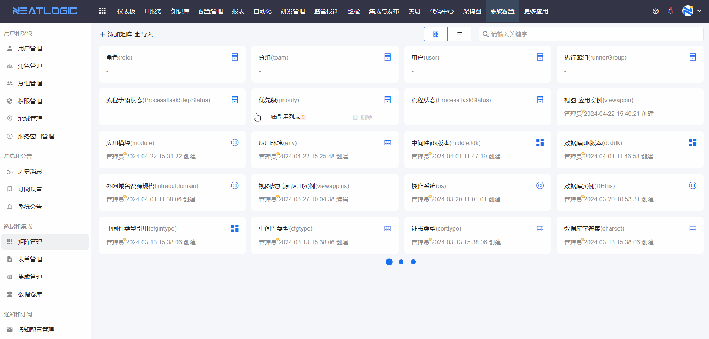
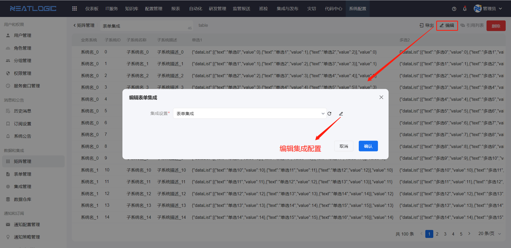
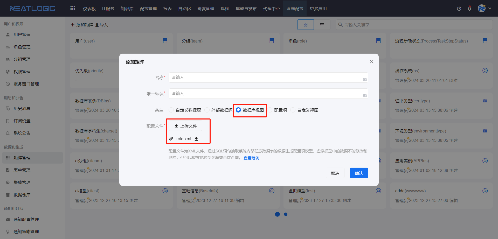
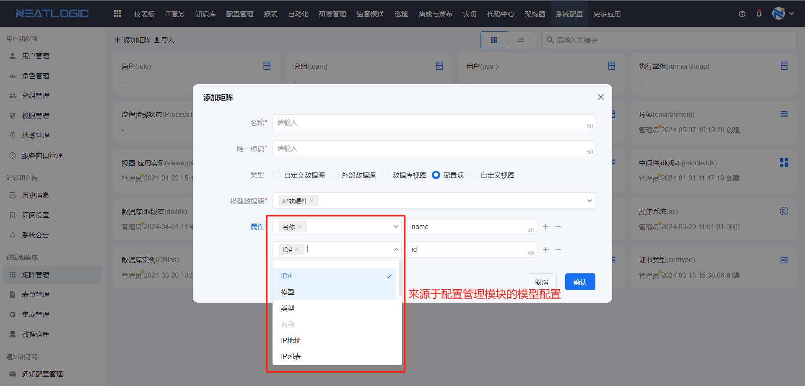

# 矩阵管理
矩阵管理页面是一个统一管理数据源的页面，主要是提供给表单、自动化工具参数、组合工具作业参数等使用。矩阵分成四种类型，包括自定义数据源、外部数据源、数据库视图和配置项。

## 矩阵类型介绍
### 自定义数据源
自定义数据源的自由度比较高，矩阵的属性完全由用户自行配置，支持批量导入数据。
步骤：添加矩阵-配置属性-添加行（数据）


导入和导出

- 导出数据：导出当前自定义数据源矩阵所有数据，导出为excel格式
- 导出模板：导出为导入数据的模板，模板是excel格式
- 导入数据：将数据导入到当前矩阵中，导入文件格式是excel格式
- 导出：导出整个矩阵，导出为bak格式

### 外部数据源
外部数据源是通过关联集成设置，调用集成设置中的外部接口获取数据作为数据源。矩阵引用的集成配置，其接口输入和输出必须转化为规范的格式，矩阵才能生成有效数据，更多请参考[集成管理](../../100.系统配置/3.数据和集成/集成管理.md)。

添加外部数据源矩阵完成后，跳转到矩阵编辑页面，支持更换关联的集成配置，但矩阵已被引用不能更换集成配置。


### 数据库视图
数据库视图是通过导入sql配置文件，查询本地数据库的数据并生成视图。


配置文件范例
```
<view>
   <!--视图字段定义，需要SQL语句返回对应列-->
  <attrs>
    <attr name="user_id" label="用户ID" />
    <attr name="user_name" label="用户名" />
    <attr name="teamName" label="分组" />
  </attrs>
  <sql>
    SELECT
    <!--必须包含id字段-->
    `u`.`id` AS id,
    <!--必须包含uuid字段-->
 `u`.`uuid` AS uuid,
    <!--下列字段需要在上面attrs中定义才生效-->
    `u`.`user_name` AS name,
    `u`.`user_id` as user_id,
    `u`.`user_name` as user_name,
    group_concat( `t`.`name`) AS teamName
    FROM `user` `u`
    LEFT JOIN `user_team` `ut` ON `u`.`uuid` = `ut`.`user_uuid`
    LEFT JOIN `team` `t` ON `t`.`uuid` = `ut`.`team_uuid`
    GROUP BY u.`uuid`
  </sql>
</view>
```

### 配置项
配置项数据源是通过关联配置项模型并选择模型属性，然后生成矩阵数据源。模型数据源参考配置管理-[模型管理](../../3.配置管理/模型管理/模型管理.md)。
