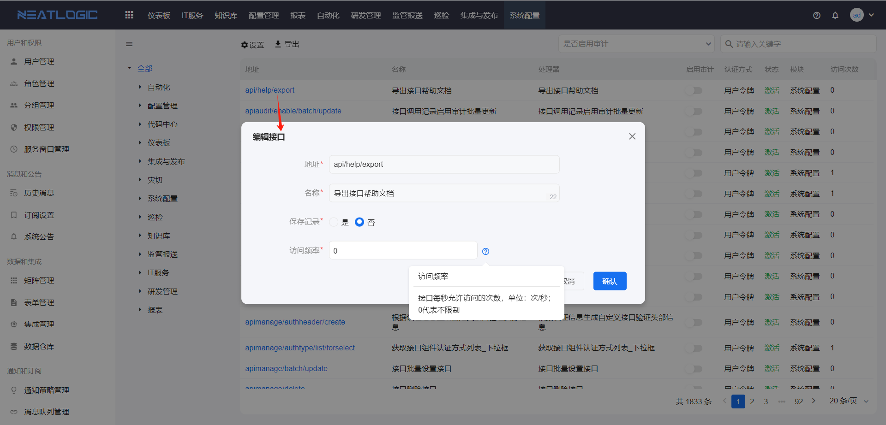
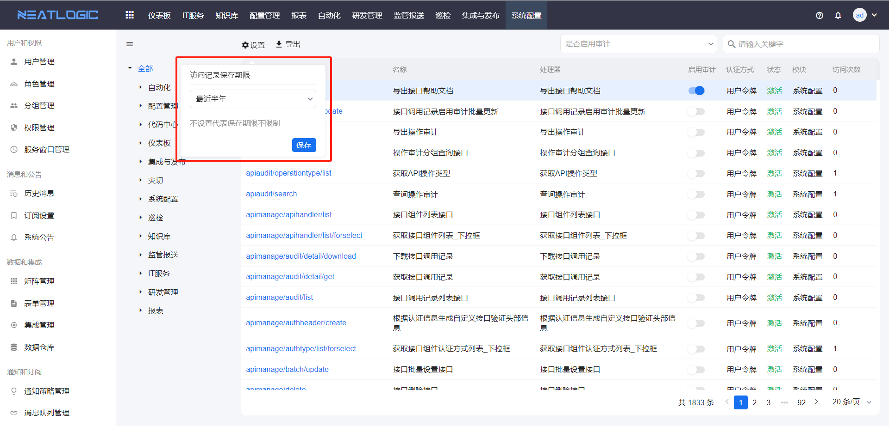

# 接口管理
接口管理是管理系统内部接口的页面，加载当前系统所有的内部定义的接口，支持导出、设置接口访问频率、启用审计、查看帮助和测试。

## 导出
把内部所有接口的详情导出为pdf文档。
  
  包括接口url、名称、描述和输入参数信息。
  

## 接口访问频率
限制每秒访问接口的次数。
  

## 启用审计
启用接口访问记录，可在调用记录中查看接口的访问记录，也可在操作审计页面查看调用记录详情。
  
  对于所有接口还支持设置访问记录保存期限，超过保留期限的访问记录系统自动删除，若不设置期限，则保留所有访问记录。
  

## 查看帮助
查看接口的帮助信息。
  ‘

## 接口认证

### Hmac认证
Hmac认证是neatlogic系统的其中一种接口认证方式，也是实名认证方式。

#### 1.获取token
需要向系统管理员获取实名用户token，用于加签。

系统管理员可以在对应用户的个人信息处获取对应token令牌，如下图

token = cddd94aede445c09bacbb85da2a683db

#### 2.设置Header
访问neatlogic系统接口需额外携带 Tenant、AuthType、Authorization、x-access-key header
    
  <table style="width:100%">
    <thead>
      <tr>
        <td>Header</td>
        <td>描述</td>
        <td>例子</td>
      </tr>
    </thead>
    <tbody>
      <tr>
        <td>Tenant</td>
        <td>租户</td>
        <td>demo</td>
      </tr>
      <tr>
        <td>Authorization</td>
        <td>认证信息</td>
        <td>Hmac<br>87d83f9d39c87d35f6925f712f7f28660e1f0637</td>
      </tr>
      <tr>
        <td>AuthType</td>
        <td>认证类型</td>
        <td>hmac</td>
      </tr>
      <tr>
        <td>x-access-key</td>
        <td>用户</td>
        <td>admin</td>
      </tr>
    </tbody>
  </table>

#### Authorization 生成规则
1、sign = x-access-key + # + requestUri +"?"+queryString+ # + base64(post body)<br>
注意:get method 没有 post body，也需要拼 #号<br>
如果没有queryString则前面的?也不需要了<br>
2、authorization = "Hmac " + HmacSHA256签名加密(token,sign)<br>
注意: "Hmac " 前缀的空格<br>
上面表格中的例子,<br>
假如 requestUri:/neatlogic/api/rest/inspect/report/get<br>
post body:<br>
{"test":"ddddd"}<br>
生成的authorization如:<br>
1、sign= admin#/neatlogic/api/rest/inspect/report/<br>
get#ewogICAgInRlc3QiOiJkZGRkZCIKfQ==<br>
2、authorization = "Hmac " + HmacSHA256签名加密(cddd94aede445c09bacbb85da2a683db,sign) = Hmac 87d83f9d39c87d35f6925f712f7f28660e1f0637

```
InputStream input = request.getInputStream();
StringBuilder sb = new StringBuilder();
BufferedReader reader;
if (input != null) {
    reader = new BufferedReader(new InputStreamReader(input));
    char[] charBuffer = new char[2048];
    int bytesRead = -1;
    while ((bytesRead = reader.read(charBuffer)) > 0) {
        sb.append(charBuffer, 0, bytesRead);
    }
}

String queryString = StringUtils.isNotBlank(request.getQueryString()) ? "?" + request.getQueryString() : StringUtils.EMPTY;
String sign = user + "#" + request.getRequestURI() + queryString + "#" + Base64.encodeBase64StringUnChunked(sb.toString().getBytes(StandardCharsets.UTF_8));
String authorization = SHA256Util.encrypt(token, sign);
```

```
/*
     * @Description: Sha1签名加密 32位 小写
     * @Date: 2021/3/18 12:20 下午
     * @Params: [content]
     * @Returns: java.lang.String
     **/
    public static String encrypt(String secret, String sign) {
        try {
            SecretKeySpec signingKey = new SecretKeySpec(secret.getBytes(), "HmacSHA256");
            Mac mac = Mac.getInstance("HmacSHA256");
            mac.init(signingKey);
            byte[] rawHmac = mac.doFinal(sign.getBytes());
            StringBuilder hexString = new StringBuilder();
            for (byte b : rawHmac) {
                String shaHex = Integer.toHexString(b & 0xFF);
                if (shaHex.length() < 2) {
                    hexString.append(0);
                }
                hexString.append(shaHex);
            }
            return hexString.toString();
        } catch (NoSuchAlgorithmException | InvalidKeyException e) {
            logger.error(e.getMessage(), e);
        }
        return "0000000000000000000000000000000000000000000000000000000000000000";
    }
```
令附上springboot调用接口demo
```
public static String encrypt(String secret, String sign) {
    try {
        SecretKeySpec signingKey = new SecretKeySpec(secret.getBytes(), "HmacSHA256");
        Mac mac = Mac.getInstance("HmacSHA256");
        mac.init(signingKey);
        byte[] rawHmac = mac.doFinal(sign.getBytes());
        StringBuilder hexString = new StringBuilder();
        for (byte b : rawHmac) {
            String shaHex = Integer.toHexString(b & 0xFF);
            if (shaHex.length() < 2) {
                hexString.append(0);
            }
            hexString.append(shaHex);
        }
        return hexString.toString();
    } catch (NoSuchAlgorithmException | InvalidKeyException e) {
        //logger.error(e.getMessage(), e);
    }
    return "0000000000000000000000000000000000000000000000000000000000000000";
}

public static void main(String[] args) {
    //请求url
    String url = "http://192.168.0.95:8282/neatlogic/api/rest/cmdb/relentity/alert/batchsave";

    //请求post data
    JSONObject postDataObj = JSONObject.parseObject("{\n" +
            "\t\"alertList\": [\n" +
            "        {\n" +
            "            \"alertMessage\": \"tomcat服务终止告警\",\n" +
            "            \"ciEntityId\": \"836825488826369\",\n" +
            "            \"ciEntityUuid\": \"a995e2b1c53341f6a7a506c11990620e\",\n" +
            "            \"level\": 3,\n" +
            "            \"ip\": \"192.168.0.95\",\n" +
            "            \"metricName\": \"tomcat33\",\n" +
            "            \"metricValue\": \"33服务down\",\n" +
            "            \"alertLink\":\"http://www.baidu.com\"\n" +
            "        },\n" +
            "        {\n" +
            "            \"alertMessage\": \"MYSQL服务告警信息\",\n" +
            "            \"ciEntityId\": \"836825740484609\",\n" +
            "            \"ciEntityUuid\": \"254c0fed9a5e4ecd9875e39692f08f53\",\n" +
            "            \"level\": 3,\n" +
            "            \"ip\": \"192.168.0.95\",\n" +
            "            \"metricName\": \"MYSQL22\",\n" +
            "            \"metricValue\": \"MYSQL22服务挂掉\",\n" +
            "            \"alertLink\":\"http://www.baidu.com\"\n" +
            "        }\n" +
            "    ]\n" +
            "}");
    System.out.println(postDataObj.toString());//打印请求body

    //将postdata加密 进而获取authorization
    String postDataBase64 = Base64Utils.encodeToString(JSON.toJSONString(postDataObj,false).getBytes(StandardCharsets.UTF_8));
    String sign = "admin" + "#" + "/neatlogic/api/rest/cmdb/relentity/alert/batchsave" + "#" + postDataBase64;
    System.out.println("sign:"+sign);
    String token = "ebf7ca184201d46d25ce0c57e5794d53";//用户token 从用户信息可以获取
    String authorization = encrypt(token, sign);//认证
    System.out.println("authorization:"+authorization);

    //设置请求头
    HttpHeaders requestHeaders = new HttpHeaders();
    requestHeaders.setContentType(MediaType.APPLICATION_JSON);
    requestHeaders.add("Tenant","demo");
    requestHeaders.add("Authorization","Hmac " + authorization);
    requestHeaders.add("AuthType","hmac");
    requestHeaders.add("x-access-key","admin");
    HttpEntity<JSONObject> requestEntity = new HttpEntity<>(postDataObj, requestHeaders);
    RestTemplate restTemplate = new RestTemplate();
    
    //调接口
    JSONObject resultObj = restTemplate.postForObject(url, requestEntity, JSONObject.class);
    System.out.println(resultObj);

}
```
## 测试
模拟发送请求，检查接口调用情况
  

## 操作审计
操作审计是汇总启用操作审计的接口调用日志的页面，提供管理员在前端页面查看重点接口的调用情况，可跟踪接口的输入参数、返回结果或异常信息。

操作审计中并不会记录所有接口的操作日志，只有启用审计的接口才会产生操作审计日志。


参数、结果和异常可查看详细信息。


所有的操作审计可以设置保留期限，与接口访问记录一样。
