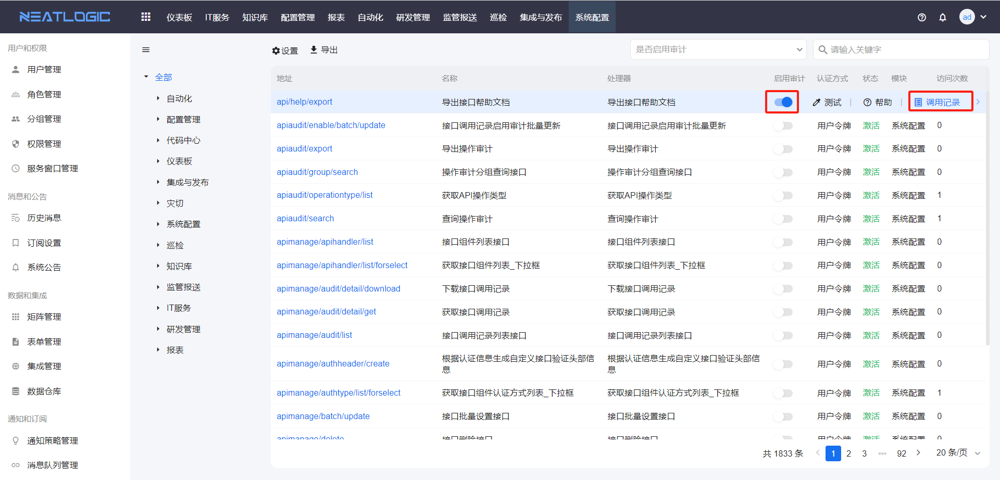

# 接口管理
接口管理是管理系统内部接口的页面，加载当前系统所有的内部定义的接口，支持导出、设置接口访问频率、启用审计、查看帮助和测试。

## 导出
把内部所有接口的详情导出为pdf文档。
  
  包括接口url、名称、描述和输入参数信息。
  

## 接口访问频率
限制每秒访问接口的次数。
  

## 启用审计
启用接口访问记录，可在调用记录中查看接口的访问记录，也可在操作审计页面查看调用记录详情。
  
  对于所有接口还支持设置访问记录保存期限，超过保留期限的访问记录系统自动删除，若不设置期限，则保留所有访问记录。
  

## 查看帮助
查看接口的帮助信息。
  ‘

## 接口认证
第三方系统如需调用接口，需要按照以下规则组织数据并进行签名加密。

### 1.获取token
每一个用户都拥有一个Token，Token值仅自己可见，用户可以随时刷新Token，第三方也需要同步更新Token值。


### 2.设置Header
访问neatlogic系统接口需额外携带 Tenant、AuthType、Authorization、x-access-key header
    
  <table style="width:100%">
    <thead>
      <tr>
        <td>Header</td>
        <td>描述</td>
        <td>例子</td>
      </tr>
    </thead>
    <tbody>
      <tr>
        <td>Tenant</td>
        <td>租户</td>
        <td>demo</td>
      </tr>
      <tr>
        <td>Authorization</td>
        <td>认证信息</td>
        <td>Hmac<br>87d83f9d39c87d35f6925f712f7f28660e1f0637</td>
      </tr>
      <tr>
        <td>AuthType</td>
        <td>认证类型</td>
        <td>hmac</td>
      </tr>
      <tr>
        <td>x-access-key</td>
        <td>用户</td>
        <td>admin</td>
      </tr>
    </tbody>
  </table>

#### Authorization 生成规则
##### 1、sign = x-access-key + # + requestUri +"?"+queryString+ # + base64(post body)<br>
注意：get method 没有post body，也需要拼接#号。 如果没有queryString，不需要提供？。
##### 2、authorization = "Hmac " + HmacSHA256签名加密(token,sign)
范例：  
请求地址：/neatlogic/api/rest/inspect/report/get  
post body:
```` json
{"test":"ddddd"}
````
拼接签名数据：  
sign=admin#/neatlogic/api/rest/inspect/report/get#ewogICAgInRlc3QiOiJkZGRkZCIKfQ==  
使用SHA256算法进行签名：  
authorization="Hmac " + HmacSHA256签名加密(用户token, sign)

``` java
InputStream input = request.getInputStream();
StringBuilder sb = new StringBuilder();
BufferedReader reader;
if (input != null) {
    reader = new BufferedReader(new InputStreamReader(input));
    char[] charBuffer = new char[2048];
    int bytesRead = -1;
    while ((bytesRead = reader.read(charBuffer)) > 0) {
        sb.append(charBuffer, 0, bytesRead);
    }
}

String queryString = StringUtils.isNotBlank(request.getQueryString()) ? "?" + request.getQueryString() : StringUtils.EMPTY;
String sign = user + "#" + request.getRequestURI() + queryString + "#" + Base64.encodeBase64StringUnChunked(sb.toString().getBytes(StandardCharsets.UTF_8));
String authorization = SHA256Util.encrypt(token, sign);
```
签名程序：
``` java
    public static String encrypt(String secret, String sign) {
        try {
            SecretKeySpec signingKey = new SecretKeySpec(secret.getBytes(), "HmacSHA256");
            Mac mac = Mac.getInstance("HmacSHA256");
            mac.init(signingKey);
            byte[] rawHmac = mac.doFinal(sign.getBytes());
            StringBuilder hexString = new StringBuilder();
            for (byte b : rawHmac) {
                String shaHex = Integer.toHexString(b & 0xFF);
                if (shaHex.length() < 2) {
                    hexString.append(0);
                }
                hexString.append(shaHex);
            }
            return hexString.toString();
        } catch (NoSuchAlgorithmException | InvalidKeyException e) {
            logger.error(e.getMessage(), e);
        }
        return "0000000000000000000000000000000000000000000000000000000000000000";
    }
```
完整调用范例：
``` java
package neatlogic.framework.apiparam.validator;

import com.alibaba.fastjson.JSON;
import com.alibaba.fastjson.JSONObject;
import okhttp3.*;
import org.springframework.http.MediaType;
import org.springframework.http.*;
import org.springframework.util.Base64Utils;
import org.springframework.web.client.RestTemplate;

import javax.crypto.Mac;
import javax.crypto.spec.SecretKeySpec;
import java.io.File;
import java.io.IOException;
import java.nio.file.Files;
import java.nio.file.Path;
import java.nio.file.Paths;
import java.util.Map;

public class HmacDemo {

    public static String encrypt(String secret, String sign) {
        try {
            SecretKeySpec signingKey = new SecretKeySpec(secret.getBytes(), "HmacSHA256");
            Mac mac = Mac.getInstance("HmacSHA256");
            mac.init(signingKey);
            byte[] rawHmac = mac.doFinal(sign.getBytes());
            StringBuilder hexString = new StringBuilder();
            for (byte b : rawHmac) {
                String shaHex = Integer.toHexString(b & 0xFF);
                if (shaHex.length() < 2) {
                    hexString.append(0);
                }
                hexString.append(shaHex);
            }
            return hexString.toString();
        } catch (Exception e) {
            e.printStackTrace();
        }
        return "0000000000000000000000000000000000000000000000000000000000000000";
    }

    public static void main(String[] args) throws IOException {
        testRestApi();


    }

    /**
     * 上传 binary
     */
    private static void testUploadBinaryApi() {
        JSONObject postDataObj = new JSONObject();
//        postDataObj.put("name", "name");
//        postDataObj.put("label", "name1");
//        postDataObj.put("icon", "name1");
//        postDataObj.put("typeId", "441079140720640");
        System.out.println(postDataObj);//打印请求body
        String cutUrl = "/neatlogic/api/binary/autoexec/script/import/forautoexec";
        String url = "http://localhost:8080" + cutUrl;
        String tenant = "develop";//租户
        String userId = "admin";//登录UserId
        String token = "eb40625d3464db3b4ddf361969524bf7";//用户token

        OkHttpClient client = new OkHttpClient();
        File file = new File("/Users/cocokong/Desktop/scripts_Demo_demo-local.pl.json");
        okhttp3.MediaType mediaType = okhttp3.MediaType.parse("multipart/form-data;");
        MultipartBody.Builder builder = new MultipartBody.Builder().setType(MultipartBody.FORM)
                .addFormDataPart("scriptInfo.json", "scripts_Demo_demo-local.pl",
                        RequestBody.create(mediaType,
                                file));
        for(Map.Entry<String,Object> entry : postDataObj.entrySet()){
            builder.addFormDataPart(entry.getKey(), entry.getValue().toString());
        }
        RequestBody body = builder.build();

        String postDataBase64 = Base64Utils.encodeToString(postDataObj.toString().getBytes());
        String sign = userId + "#" + cutUrl + "#" + postDataBase64;
        System.out.println("sign:" + sign);
        String authorization = encrypt(token, sign);//认证
        System.out.println("authorization:" + authorization);

        Request request = new Request.Builder()
                .url(url)
                .post(body)
                .addHeader("Tenant", tenant)
                .addHeader("Authorization", "Hmac " + authorization)
                .addHeader("AuthType", "hmac")
                .addHeader("x-access-key", userId)
                .addHeader("Content-Type", "multipart/form-data")
                .build();

        try {
            Response response = client.newCall(request).execute();
            System.out.println(response.body().string());
        } catch (IOException e) {
            e.printStackTrace();
        }
    }


    /**
     * 下载 binary
     */
    private static void testDownloadBinaryApi() throws IOException {
        //请求url
        String cutUrl = "/neatlogic/api/binary/file/download";
        String url = "http://localhost:8080" + cutUrl;
        String tenant = "develop";//租户
        String userId = "admin";//登录UserId
        String token = "eb40625d3464db3b4ddf361969524bf7";//用户token 从”页面右上角头像-》个人设置-〉基础信息“可以获取
        JSONObject postDataObj = JSONObject.parseObject("{\"id\":1084815183822848}");//请求post data
        System.out.println(postDataObj.toString());//打印请求body

        //将postdata加密 进而获取authorization
        String postDataBase64 = Base64Utils.encodeToString(JSON.toJSONString(postDataObj, false).getBytes());
        String sign = userId + "#" + cutUrl + "#" + postDataBase64;
        System.out.println("sign:" + sign);
        String authorization = encrypt(token, sign);//认证
        System.out.println("authorization:" + authorization);

        //设置请求头
        HttpHeaders requestHeaders = new HttpHeaders();
        requestHeaders.setContentType(MediaType.APPLICATION_JSON);
        requestHeaders.add("Tenant", tenant);
        requestHeaders.add("Authorization", "Hmac " + authorization);
        requestHeaders.add("AuthType", "hmac");
        requestHeaders.add("x-access-key", userId);
        HttpEntity<JSONObject> requestEntity = new HttpEntity<>(postDataObj, requestHeaders);
        RestTemplate restTemplate = new RestTemplate();

        //调接口
        ResponseEntity<byte[]> response = restTemplate.exchange(url, HttpMethod.POST, requestEntity, byte[].class);
        byte[] fileContent = response.getBody();
        Path destination = Paths.get("/Users/cocokong/Desktop/test.png");
        Files.write(destination, fileContent); // 将文件内容写入到目标路径中
    }

    /**
     * 普通接口
     */
    private static void testRestApi() {
        String cutUrl = "/neatlogic/api/rest/cmdb/cientity/search";
        String url = "http://localhost:8080" + cutUrl;
        String tenant = "develop";//租户
        String userId = "admin";//登录UserId
        String token = "eb40625d3464db3b4ddf361969524bf7";//用户token 从”页面右上角头像-》个人设置-〉基础信息“可以获取
        JSONObject postDataObj = JSONObject.parseObject("{\"ciId\":479609502048256,\"keyword\":\"Test\"}");//请求post data
        System.out.println(postDataObj.toString());//打印请求body

        //将postdata加密 进而获取authorization
        String postDataBase64 = Base64Utils.encodeToString(JSON.toJSONString(postDataObj, false).getBytes());
        String sign = userId + "#" + cutUrl + "#" + postDataBase64;
        System.out.println("sign:" + sign);
        String authorization = encrypt(token, sign);//认证
        System.out.println("authorization:" + authorization);

        //设置请求头
        HttpHeaders requestHeaders = new HttpHeaders();
        requestHeaders.setContentType(MediaType.APPLICATION_JSON);
        requestHeaders.add("Tenant", tenant);
        requestHeaders.add("Authorization", "Hmac " + authorization);
        requestHeaders.add("AuthType", "hmac");
        requestHeaders.add("x-access-key", userId);
        HttpEntity<JSONObject> requestEntity = new HttpEntity<>(postDataObj, requestHeaders);
        RestTemplate restTemplate = new RestTemplate();

        //调接口
        JSONObject resultObj = restTemplate.postForObject(url, requestEntity, JSONObject.class);
        System.out.println(resultObj);
    }
}

```
## 测试
模拟发送请求，检查接口调用情况
  

## 操作审计
操作审计是汇总启用操作审计的接口调用日志的页面，提供管理员在前端页面查看重点接口的调用情况，可跟踪接口的输入参数、返回结果或异常信息。

操作审计中并不会记录所有接口的操作日志，只有启用审计的接口才会产生操作审计日志。


参数、结果和异常可查看详细信息。


所有的操作审计可以设置保留期限，与接口访问记录一样。
