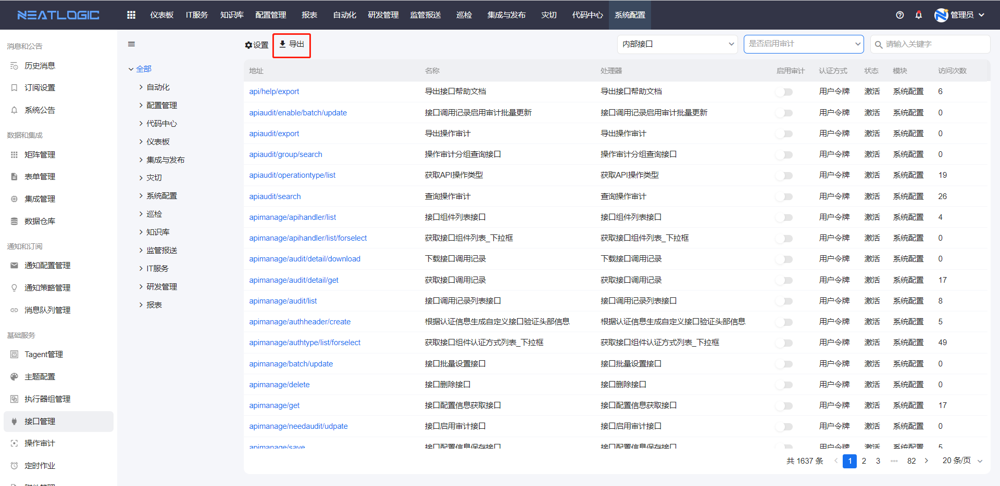
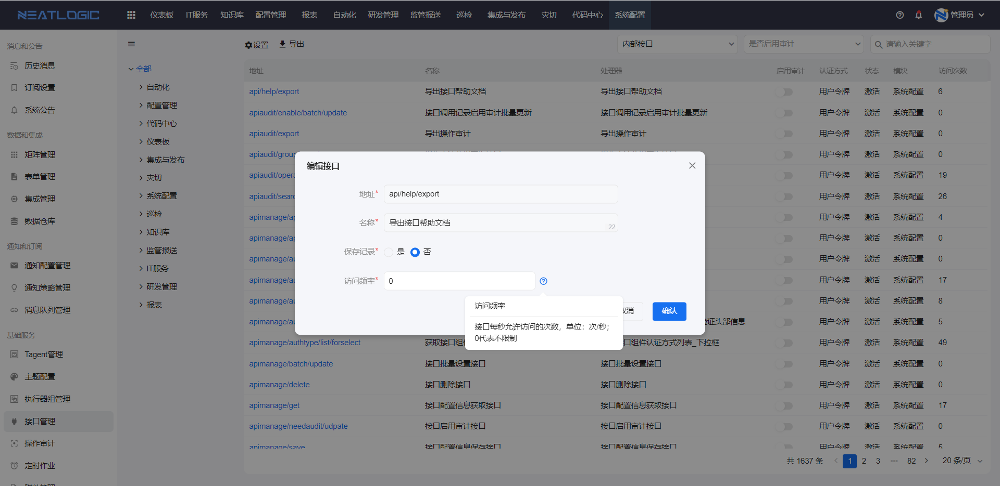
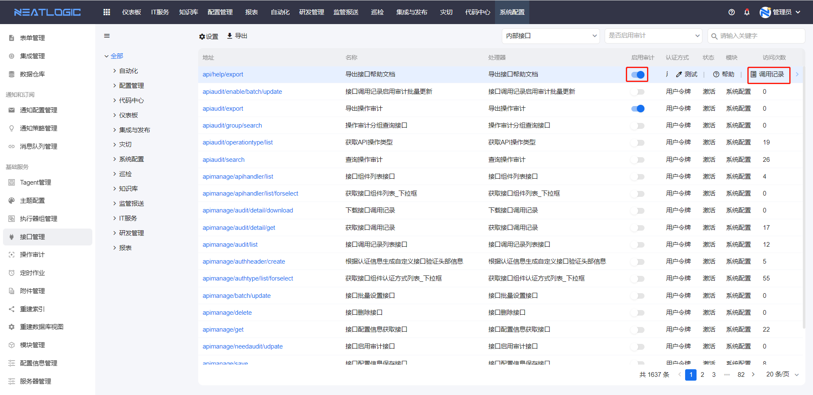
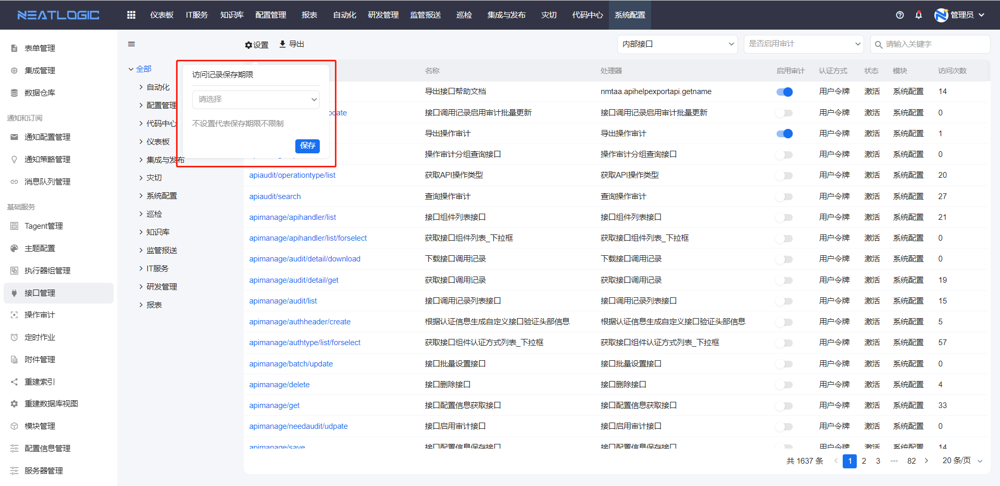
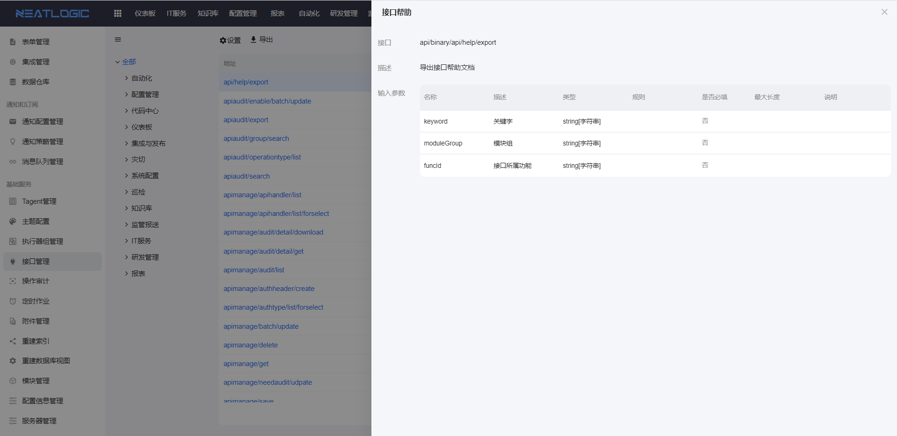
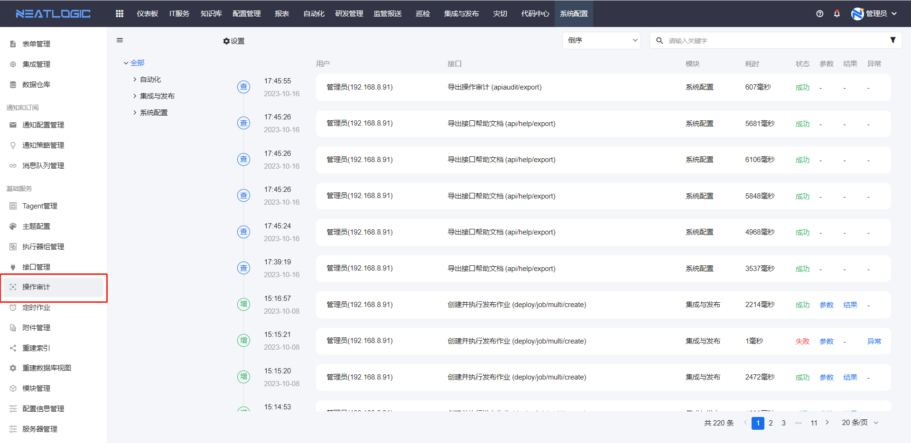

# 接口管理
接口管理是管理系统内部和外部接口的页面，内部接口是系统自动加载的接口，外部接口由用户自定义添加的接口。

## 内部接口
内部接口分类中会加载当前系统所有的内部定义的接口，内部接口不能修改接口信息，支持导出、设置接口访问频率、启用审计、查看帮助和测试。

-  导出：把内部所有接口的详情导出为pdf文档。
  
  包括接口url、名称、描述和输入参数信息。
  

- 接口访问频率：限制每秒访问接口的次数。
  

- 启用审计：启用接口访问记录，可在调用记录中查看接口的访问记录，也可在[操作审计](#操作审计)页面查看调用记录详情。
  
  对于所有接口还支持设置访问记录保存期限，超过保留期限的访问记录系统自动删除，若不设置期限，则保留所有访问记录。
  

- 查看帮助：查看指定接口的帮助信息。
  

- 测试：在测试弹窗中填写测试的输入参数数据，发送请求，检查接口是否能正常调用。
  

## 外部接口
外部接口分类中只能添加系统提供的处理器配置的接口，目前支支持basic认证。外部接口也支持设置访问记录保存期限、启用审计、测试、帮助等操作，外部接口还支持复制和删除。

## 操作审计
操作审计是汇总启用操作审计的接口调用日志的页面，提供管理员在前端页面查看重点接口的调用情况，可跟踪接口的输入参数、返回结果或异常信息。

操作审计中并不会记录所有接口的操作日志，只有启用审计的接口才会产生操作审计日志。

参数、结果和异常可查看详细信息。

所有的操作审计可以设置保留期限，与接口访问记录一样。
