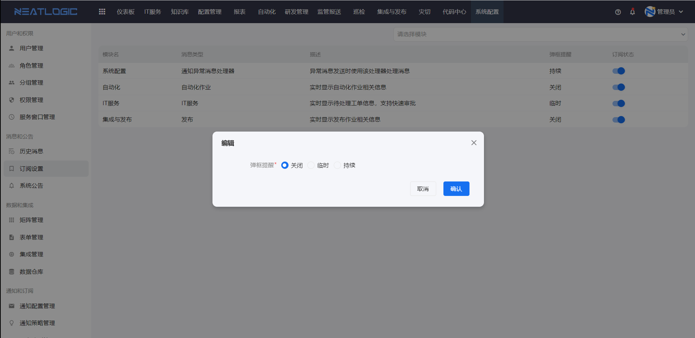
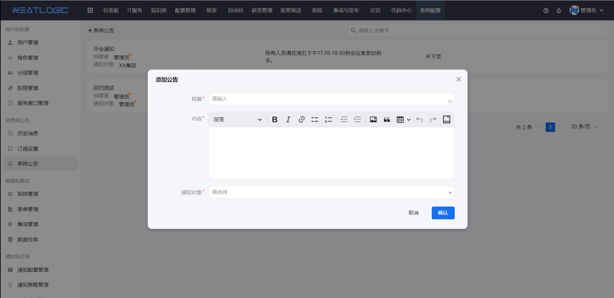
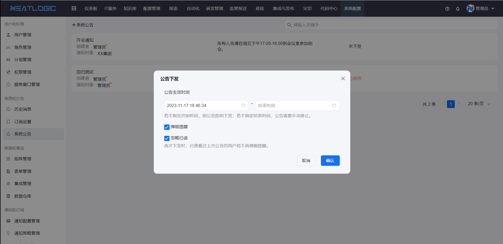
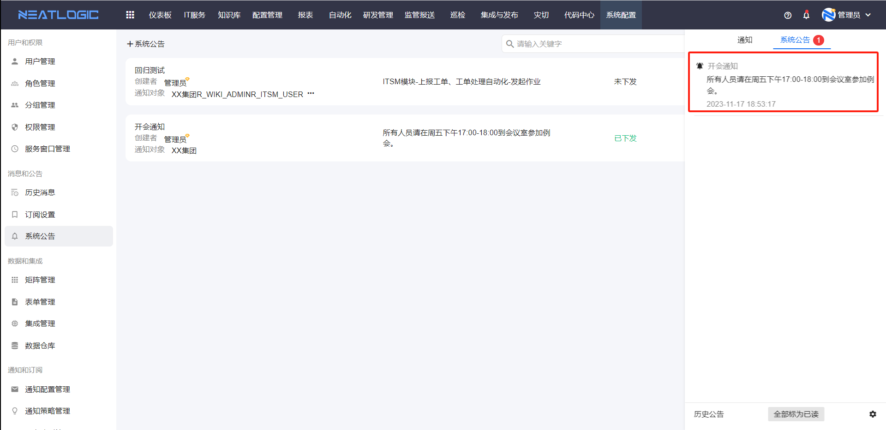
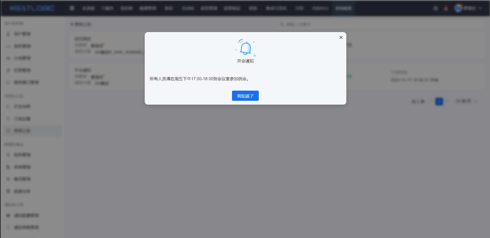

# 历史消息
历史消息页面是汇总当前用户收到的所有系统消息，消息的状态包括未读和已读。

### 标记为已读
单击消息可以展开查看详情，消息的状态变成已读，消息支持意见全部标记为已读。

### 通知
在页面右上方有一个系统通知图标，可以查看当前用户的未读消息，点击历史消息可以跳转到历史消息页面。

### 触发消息的场景
首先各个模块必须订阅了通知，相应模块才能发起通知，详情参考[订阅设置](#订阅设置)。
1. IT服务的通知，包括节点动作的通知、工单层面活动的通知、时效通知。详情参考流程管理的[通知设置](../2.IT服务/流程管理/流程管理.md/#节点设置)、[流程设置](../2.IT服务/流程管理/流程管理.md/#流程设置)和[时效设置](../2.IT服务/流程管理/流程管理.md/#时效设置)

2. 自动化的通知，详情参考组合工具的[失败通知](../5.自动化/组合工具/组合工具.md/#失败通知)。

3. 集成和发布的通知，详情参考[应用配置](../6.集成与发布/应用配置.md/#应用层)

# 订阅设置
订阅设置主要是控制模块的消息通知订阅状态和通知方式。

### 订阅状态
模块启用订阅，相应的消息通知才能发送。

### 通知方式
消息通知方式默认在通知列表中，另外还支持弹窗提醒。弹窗提醒状态包括关闭、临时还是持续。

# 系统公告
系统公告是系统通知，由管理员添加公告并下发后，所有指定的通知人都会受到系统通知，通知方式有仅在公告栏提示和全屏弹框提醒两种。

### 添加公告
点击添加系统公告按钮，公告配置中包括标题、内容和通知对象。

### 下发
添加的公告只是一个模板，必须执行下发，才能通知到指定用户。

公告下发的配置由公告生效时间和弹窗提醒。

- 生效时间：公告开始到结束的时间；若没有设置开始时间，即公告马上下方；若没有结束时间，公告会一直提示直到用户已阅。下图是下发成功后，系统公告栏的效果。
  
- 弹窗提醒：全屏弹窗提示，用户关闭弹窗即标为已读。
  
- 忽略已读：再次下发公告时，不再下发给已读上次公告的用户。

### 历史公告
历史消息页面有历史系统公告。
