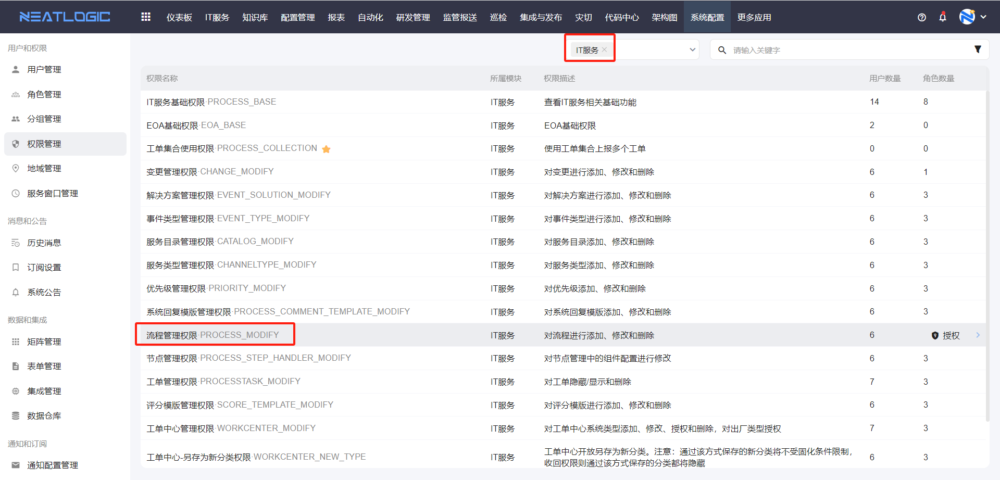
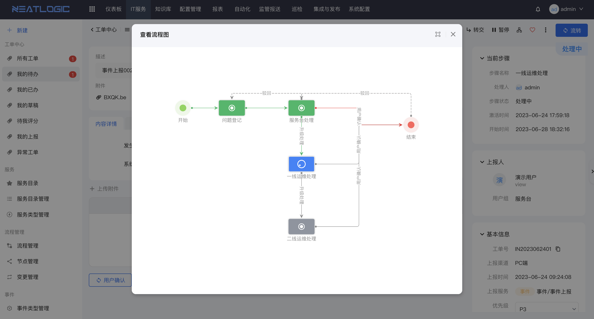
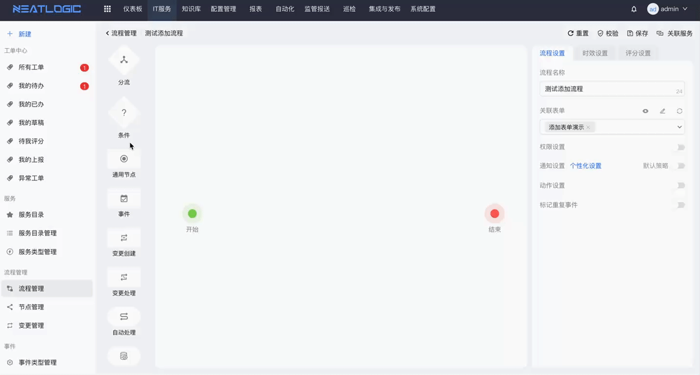
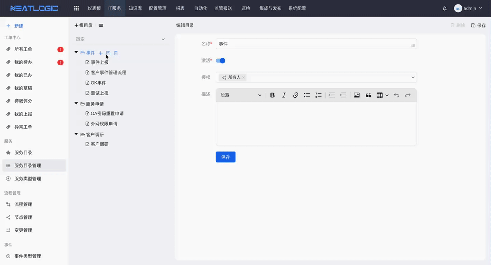
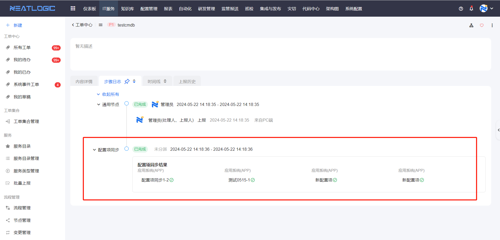
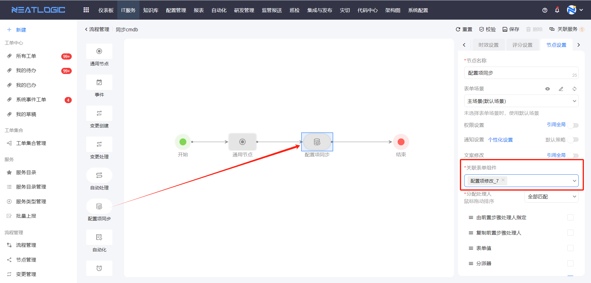
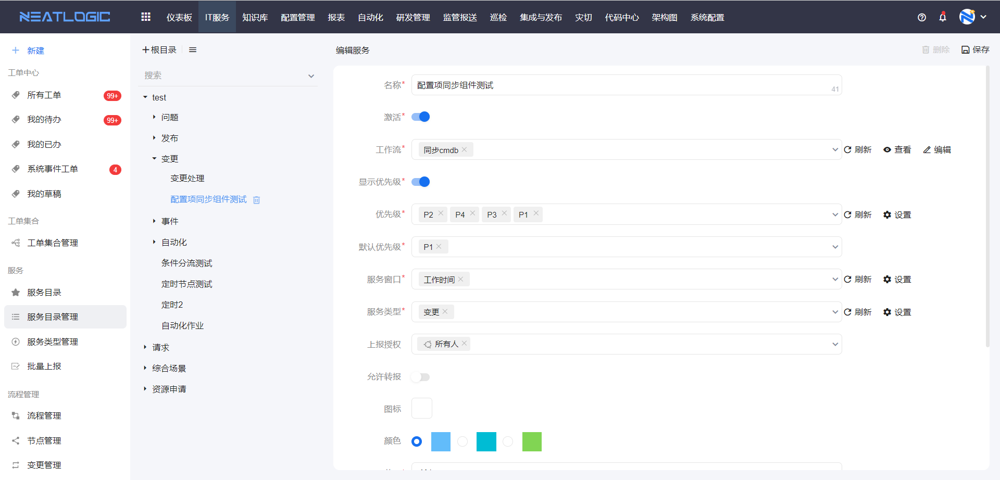
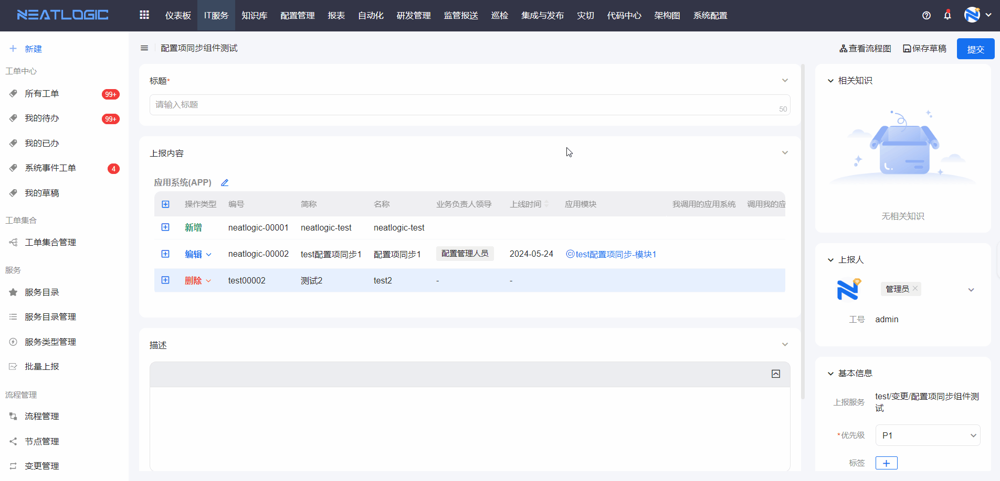

# 如何发起一个工单
发起工单前需要配置管理人员完成基础的配置，步骤如下：
1. 创建表单
2. 创建流程
3. 添加服务

完成服务的配置后，用户才能通过服务应用发起工单 。

## 权限
添加服务目录为系统管理功能，需要当前用户拥有以下权限。

- 表单管理权限

- 流程管理权限

- 服务目录管理权限
 

## 创建表单

**表单**：即用户在上报页面填写的上报内容，如下图

ITSM系统，需要用户根据不同的工单上报场景，添加自定义表单

- 添加表单入口

系统配置->表单管理->添加表单

- 添加表单控件

支持文本框、富文本框、下拉、单选、多选、时间、等组件，根据服务需求，将需要的控件拖拽到表单区域即可
 
表单更多详情参考文档：[表单管理](../100.系统配置/3.数据和集成/表单管理.md).

## 添加流程

**流程**：即用户上报工单后，后台的处理过程，如下图

ITSM系统，需要用户根据不同的工单上报场景，添加自定义流程

- 添加入口

- 设置流程属性

选择关联表单、设置权限、选择通知策略

- 拖拽流程节点步骤

- 设置流程节点

设置节点名称、处理人、权限、通知策略等

流程更多详情请参考文档：[流程管理](流程管理/流程管理.md)。

## 添加服务目录

- 添加入口

- 添加服务目录
设置服务名称、选择流程、选择优先级、服务窗口、服务类型等

服务目录更多详情请参考文档：[服务目录管理](服务/服务目录管理.md)。

## 上报工单

上报工单更多详情请参考文档：[工单上报](工单上报/工单上报.md)。

# IT服务与配置管理的关联场景

## 配置项同步
通过工单将配置项变更数据同步到配置管理，同步效果如图所示。
   
  1. 设计包含配置项修改组件的表单。
  2. 设计包含配置项同步节点的流程。
  3. 配置发起配置项变更的服务。
  4. 发起工单，并同步配置项数据。

### 表单配置
打开表单管理，设计配置项同步的表单，在表单中添加**配置项修改**组件，详情参考[表单管理](../100.系统配置/3.数据和集成/表单管理.md)-表单配置-表单组件-组件配置-配置项修改。

### 流程配置
打开流程管理，设计配置项修改并同步的流程，流程中要用到配置项同步节点，详情参考 [流程管理](流程管理/流程管理.md)-流程节点-配置项同步节点。

### 创建服务
在服务目录管理页面，添加一个服务，服务工作流引用上述的配置项同步流程，详情参考 [服务目录管理](服务/服务目录管理.md) 文档。

### 上报和处理
上报工单，在配置项修改组件中添加新增、编辑或删除配置项的操作。

完成变更后提交工单，流转到配置项同步节点，自动将数据同步到配置管理中，可在步骤日志查看同步结果。

更多详情参考文档：[工单上报](工单上报/工单上报.md)，[工单处理](工单处理/工单处理.md)。