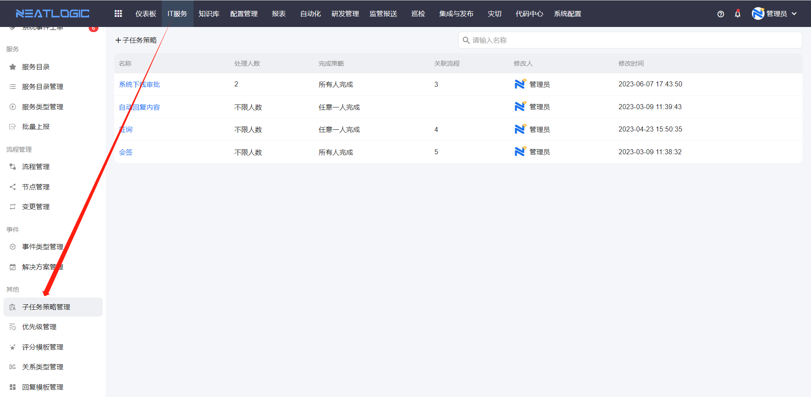
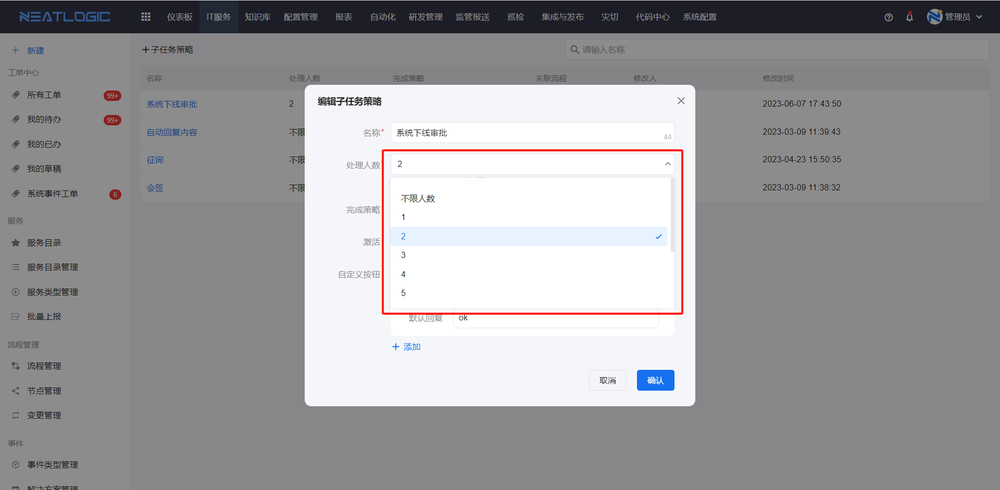
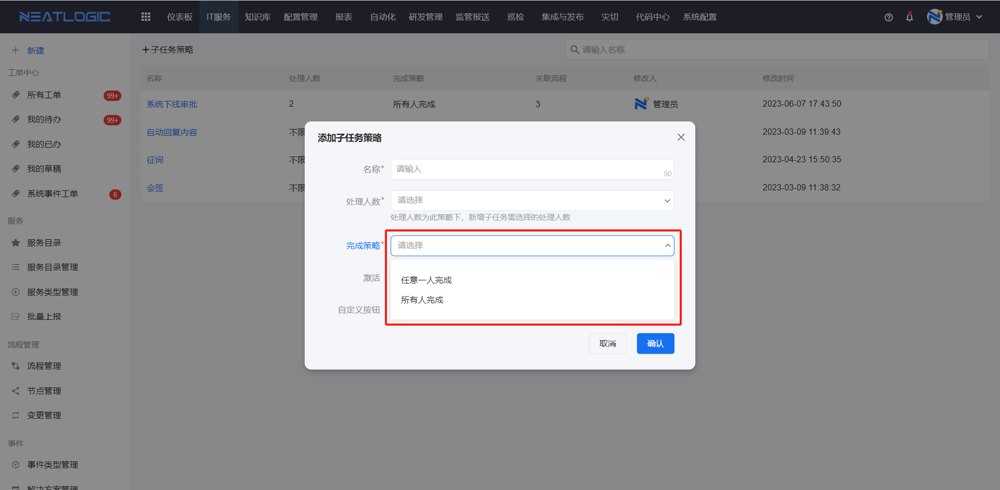
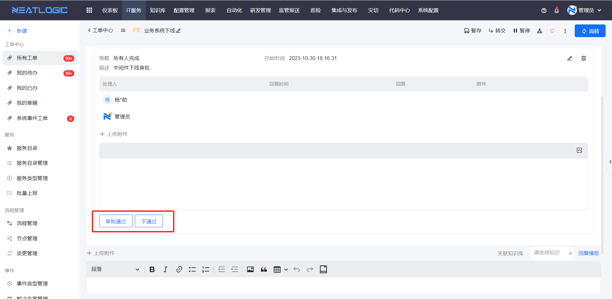
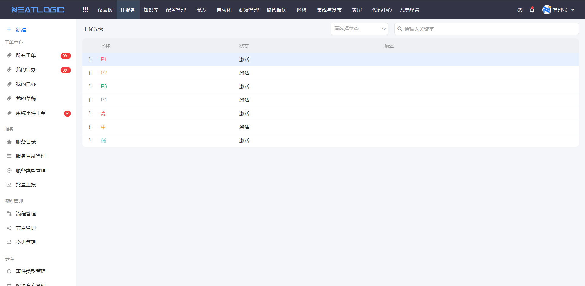
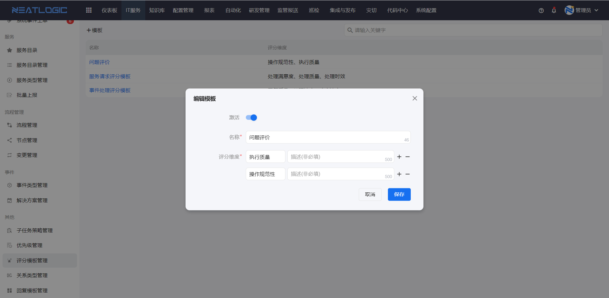
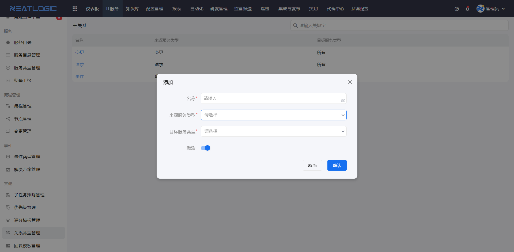
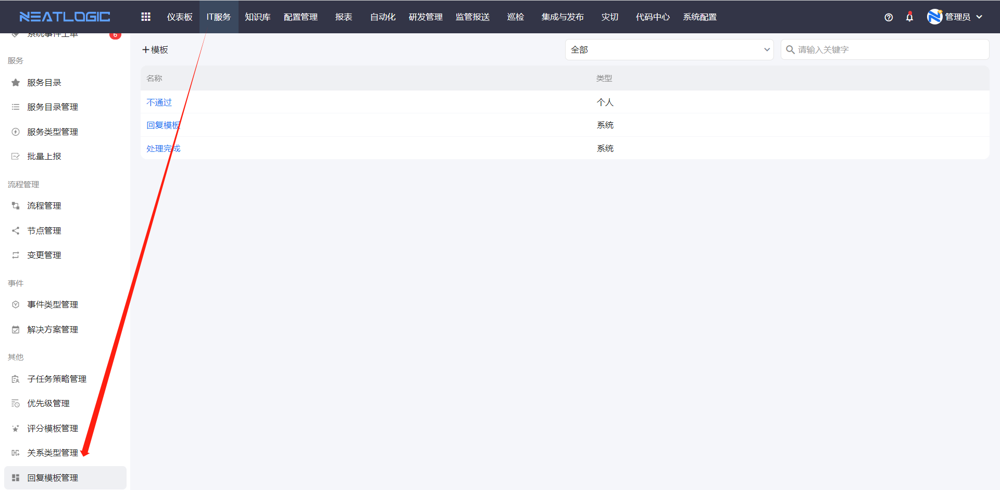
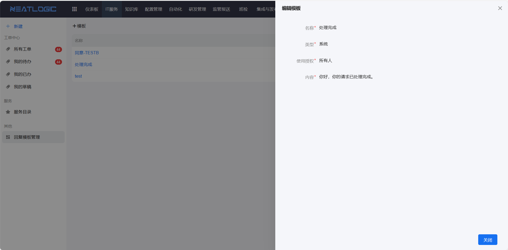

## 1、子任务策略管理
子任务策略是一个定义了处理人数、完成策略和按钮的子任务策略模板，应用于流程管理-[节点设置](../流程管理/流程管理.md)的添加子任务配置。

### 子任务策略-处理人数
子任务策略中定义了处理人数，添加子任务时会按照策略的处理人数来限制子任务处理人数量，不满足就无法保存子任务。处理人数支持1-10人或者不限人数。

### 子任务策略-完成策略
子任务完成策略是用来限制工单流转的，当工单中添加了子任务后，必须满足子任务策略中定义的完成策略，才能够流转，否则无法流转。完成策略包括任意一人完成或者所有人完成。

### 子任务自定义按钮
子任务的自动回复按钮定义了按钮及其默认回复内容，处理子任务时，回复输入框会显示自定义的按钮，点击相应按钮后会自动回复。

例如系统下线流程的节点引用了子任务策略，子任务的按钮配置如所示

在工单相应节点添加子任务，处理人操作时，输入框显示相应的处理按钮，如图所示。

点击“审批通过”按钮，自动回复“ok”。

## 2、优先级管理
优先级管理中是管理工单服务的优先级的页面，激活的优先级才能使用。优先级主要是应用于[服务目录管理](../服务目录管理/服务目录管理.md)的服务配置中。

优先级管理页面可以对优先级排序，这个顺序会应用到工单的优先级下拉选项列表中。

## 3、评分模板管理
评分模板的配置主要是评分维度及描述，评分模板应用于流程管理的[评分设置](../流程管理/流程管理.md)。

## 4、关系类型管理
关系类型管理是指服务类型之前的关系，关系类型是有指向的方向的，定义了来源服务类型和目标服务类型。

关系类型应用于工单转报，详情参考服务目录管理-服务-[转报设置](../服务/服务目录管理.md)。

## 5、回复模板管理
回复模板支持用户将高频的回复内容保存为模板，在工单处理过程中，可选择回复模板，提高工单处理的效率。回复模板页面是开放的，所有用户都可见。

关于回复模板管理页面的数据权限：
1. 有回复模板管理权限的用户，可见的数据范围是“所有系统模板+当前用户个人模板”
2. 无回复模板管理权限的用户，可见的数据范围是“有数据权限的系统模板+当前用户个人模板”

关于回复模板的编辑权限：
1. 有回复模板管理权限的用户，可添加、编辑和删除所有的系统模板和当前用户个人模板
2. 无回复模板管理权限的用户，可查看的系统模板只读，可添加、编辑和删除当前用户个人模板。
   

关于工单处理页面回复模板的数据权限
- 回复模板列表只展示当前用户有数据权限的系统模板和当前用户的个人模板