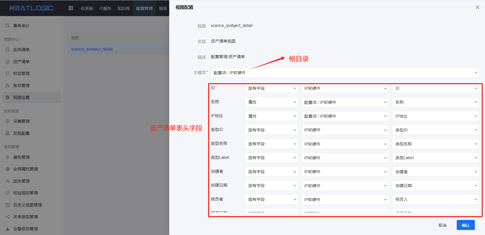
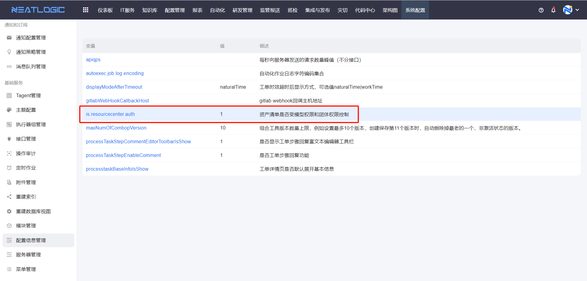
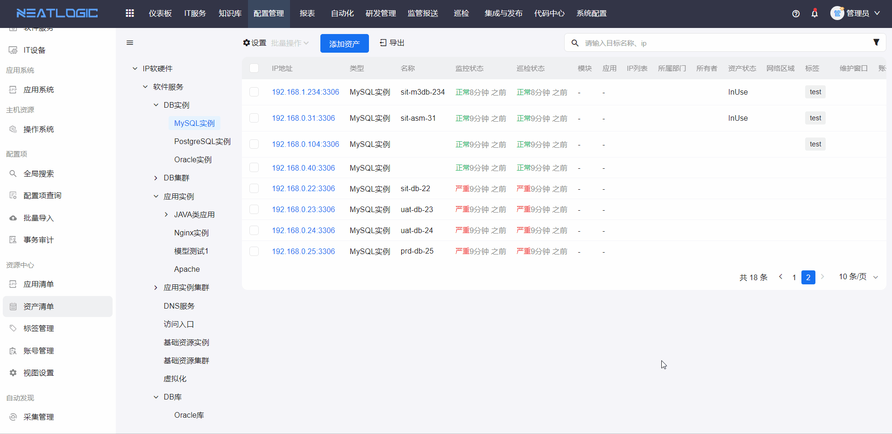
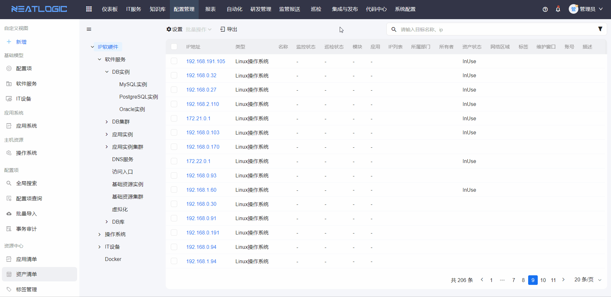
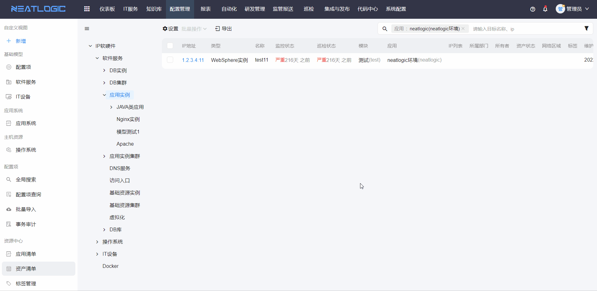
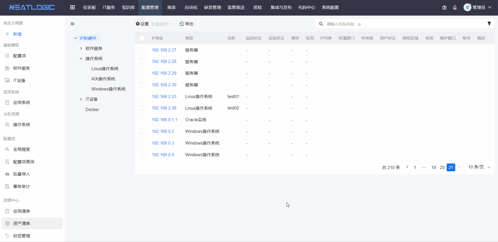

# 资产清单
IP资产的汇总清单，列表中展示所有资产的配置信息以及巡检状态。
 
访问权限：用户最少需要拥有四个基础权限（自动化基础权限、发布基础权限、巡检基础权限、灾备切换基础权限）的任意一个。

资产清单页面允许查看、删除和搜索资产，还能管理资产关联的账号和资产所属的标签。

## 资产清单数据源配置
资产清单的树目录可在“设置”中修改，“设置”中选择的配置项模型及其下级模型回显为资产清单的树目录。

配置项模型数据源的根目录是由[视图设置](../资源中心/视图设置.md)中 scence_ipobject_detail 视图的主模型控制的。

资产清单表格的数据是查询scence_ipobject_detail视图得到。表格的表头字段与scence_ipobject_detail视图字段对应。通过对scence_ipobject_detail视图字段做映射，控制资产清单表格显示内容。

**注意：** 若视图的字段映射为空，资产清单列表将不展示对应的字段；如果该字段是搜索组件的搜索条件，无法用该字段搜索。

## 资产过滤配置
资产清单中默认回显资产清单视图所有数据，不受模型权限和团体权限控制，包括查看和管理权限。
 
系统配置信息管理有一个变量，可以控制资产清单数据是否受模型权限和团体权限控制。
 
配置入口：系统配置--配置信息管理

变量 is.resourcecenter.auth 为0时，表示不启用；变更的值为1时，表示启用。

## 搜索
资产清单页面支持通过连接协议、资产状态、巡检状态、环境、系统、模块、状态和标签来过滤IP资产。

## 查看资产详情
在资产清单列表中，点击IP地址，跳转到对应资产的配置项详情页面。

补充说明：用户只有查看父模型配置项的权限，没有子模型权限，查看子模型的配置项详情时，会提示缺少模型查看权限。

## 管理资产
在配置模型列表选中目标模型，页面上方有添加资产操作，光标聚焦到资产上，显示编辑和删除按钮。实际操作如图，操作人需要拥有相应配置模型管理权限。

## 管理资产账号
点击资产上的账户管理按钮，页面出现账户管理弹窗，编辑关联公共账号或私有账户并保存即可。公共账号来源于[账号管理](../资源中心/账号管理.md)。

以上是在资产清单页面快速管理资产的方法，此外，还可以在配置项查询页面，找到需要配置资产的模型，在模型的配置项列表增、删、改资产对象。 
以在window操作系统下添加新的资源为例。

## 管理资产标签
点击资产上的标签管理按钮，页面出现标签管理弹窗，编辑标签并保存即可。标签数据源来自[标签管理](../资源中心/标签管理.md)。

## 批量操作
资产清单页面，可通过批量勾选资产对象，展开批量操作，根据场景进行批量增加标签或账户，以及批量删除标签、账户或资产。
