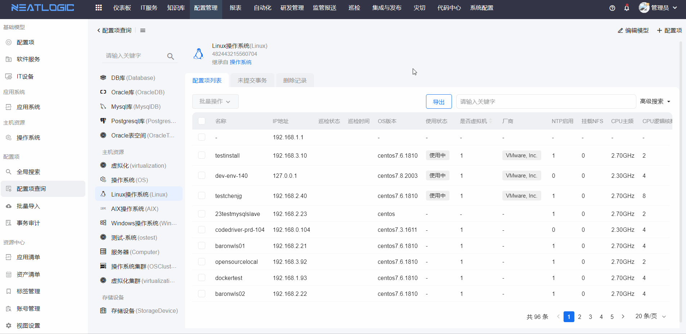
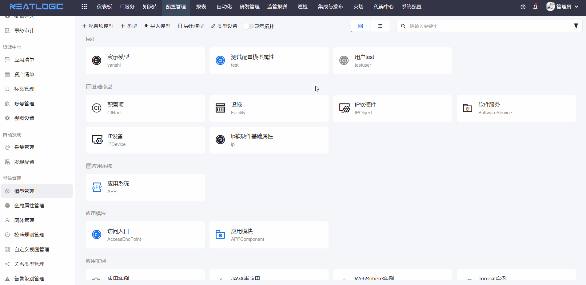

## 怎么添加配置项数据，例如添加一个linux操作系统数据
普通模型才能添加配置项，抽象模型只能用于继承，关于各类型模型的概念，请参考[**模型管理**](模型管理/模型管理.md/#名词解释)。

添加配置项的操作步骤：
1. 打开 **配置项查询** 页面，搜索需要添加配置项的配置模型（普通模型）。
   
2. 点击配置模型卡片，跳转到配置模型的配置项列表
   
3. 点击添加配置项按钮，打开添加配置项页面，填写配置项数据，点击保存为事务并提交即可。
   

以上是基于用户已经有模型的新增配置项权限。如果模型类型是普通模型，但是配置项列表没有添加配置项按钮，需要通过配置项模型管理员（有配置项模型管理权限的用户）授权新增配置项权限。

## 怎么实现自动采集资产
参考文档 [**数据采集和巡检**](/数据采集/1.数据采集和巡检.md)。

## 资产清单无法正常加载
配置管理 -> 资源中心 -> 点击查看视图，看映射配置是否完整，默认出厂是有对应的配置，倘若配置模型存在模型删除、字段删除会导致[视图](../3.配置管理/资源中心/视图设置.md)需要重新配置和映射。

## 如何批量导入数据
配置管理 -> 批量导入 -> 下载模版，选择对应需要导入的管理模型Execl模版文件。按模版字段填写数据，再上传Execl文件，发起新增/修改导入。
 
<b>说明:</b> 参考批量导入文档。

## 如何获取CMDB配置项的数据变化
外围系统可基于ActiveMq实现消息订阅。 
<b>前提：</b>
* 系统管理 -> 消息队列管理 -> 主题管理，激活配置新增、修改、删除消息主题。
* 有启动ActiveMQ消息队列服务。
* 应用的配置文件有指向对应的MQ服务地址。

## 取数需求同时涉及多个配置管理模型数据联合查询，数据如何获取
基于配置视图，多个模型关联查询，输出数据。

## 配置管理是否提供接口
系统管理 -> 接口管理 -> 配置管理 ，所有API接口都存在，按需获取。

## 全局属性是用在什么地方
全局属性用于全局性过滤，而且过滤会沿着关系传播出去。

可以用在环境，受益人等场景。例如展开某个应用的topo图时，就可以这个全局属性过滤某个环境的节点。

这个全局属性有个特性，如果为空，就不受过滤条件约束。例如以环境为例子，像机房的配置项是没有环境的，所以搜索时无论怎么选择，都会把机房带出来。

## 这个Agent能从平台直接下发到目标服务器并安装么？只能挨个登录服务器去手动安装？
可以通过脚本批量推安装。Agent批量推送，也是一种自动化场景，批量推送需要目标机器登录账号、密码。如果能继承堡垒机，获取目标机器的账号的密码，即可实现批量推送和安装。另外一种做法是做虚拟机模版，虚拟机模版内打进去agent，os启动后，agent自动安装。