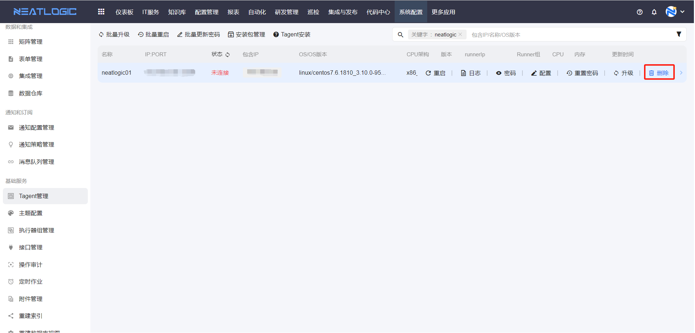

# 关于neatlogic-tagent
用于部署在受管目标操作系统上，平滑替代主机连接协议一种可选方式，tagent具备以下几点特点：
<ol>
<li>采用perl语言开发，运行环境依赖要求极低。</li>
<li>支持常见的Windows、Linux、SUSE、Aix等操作系统。</li>
<li>对操作系统资源极少，资源范围为：cpu <= 2%,内存：<= 200MB。</li>
<li>同一受管机器，支持多用户安装。</li>
<li>与<a href="../../../neatlogic-runner" target="_blank">neatlogic-runner</a>建立心跳连接，定期探测目标环境和服务可用性。</li>
<li>支持从<a href="../../../neatlogic-runner" target="_blank">neatlogic-runner</a>注册、管理、以及自动匹配管理网段下发执行。</li>
<li>支持在<a href="../../../neatlogic-web" target="_blank">neatlogic-web</a>上查看日志、重启、修改配置、升级等操作。</li>
</ol>

# 适用场景
neatlogic-tagent常见几种适用场景：
<ol>
<li>Windows类机器。</li>
<li>机器账号密码经常变更。</li>
<li>机器上多账号，不想在平台上维护不同用户密码。</li>
<li>深度使用自动化运维，如：资源安装交付。</li>
</ol>

# tagent安装
## 登录neatlogic平台，添加执行器组。
即在"系统配置"->"执行器组管理"页面添加runner组，网段的范围必须包含tagent的ip地址。
> 注意：0.0.0.0/0 表示匹配所有ip


## 安装步骤：
- 开通网络策略
- 获取安装包
- 在目标受管机器安装
### 开通网络策略
<table style="width:100%">
    <tr>
        <th>源IP</th>
        <th>目的IP</th>
        <th>目的端口</th>
        <th>协议</th>
        <th>备注</th>
    </tr>
    <tr>
        <td>neatlogic-tagent-client主机</td>
        <td>neatlogic-runner主机</td>
        <td>8084/8888</td>
        <td>TCP</td>
        <td>
            8084注册端口/
            8888心跳端口
        </td>
    </tr>
    <tr>
        <td>neatlogic-runner主机</td>
        <td>neatlogic-tagent-client主机</td>
        <td>3939</td>
        <td>TCP</td>
        <td>命令下发端口</td>
    </tr>
</table>

### 获取安装包
neatlogic-tagent两种获取安装包：
- 基于<a href="https://gitee.com/neat-logic/neatlogic-tagent-client" target="_blank">neatlogic-tagent-client</a>工程打包。源代码和资源都在这个项目里，需要自己编译，社区版暂不提供如何编译。有兴趣可以自己研究下。
```
说明：windows安装包内嵌了Perl运行时依赖环境和7z工具。
```
- 从<a href="https://gitee.com/neat-logic/neatlogic-tagent-client" target="_blank">neatlogic-tagent-client</a>获取现成安装包（请查看readme）
```
#####安装包说明############
#neatlogic-runner 自带3个安装包
#Unix类：tagent.tar
#Windows 32类：tagent_windows_x32.zip
#Windows 64类：tagent_windows_x64.zip
```
- 为了后续服务器可便利通过runner服务链接下载tagent安装包。再经过以上方法获取完安装包后，可以放到runner配置文件application.properties中tagent.download.path配置声明的路径下。以下以runner ip 192.168.0.21为例子：
```
#eg:获取Unix安装包
# 格式: http://neatlogic-runner机器IP:8084/autoexecrunner/tagent/download/tagent.tar
# 示例
curl tagent.tar http://192.168.0.21:8084/autoexecrunner/tagent/download/tagent.tar

#eg: 获取Windows 64位安装包
# 示例
curl tagent_windows_x64.zip http://192.168.0.21:8084/autoexecrunner/tagent/download/tagent_windows_x64.zip
```

### 安装
- Unix类操作系统建议以root用户安装，root安装的Agent会注册服务。
- Windows操作系统需以管理方式打开cmd窗口进行安装。

#### 手动安装
- Linux | SUSE | Aix |Unix 类安装
```
# 登录目标受管机器，下载安装包,建议统一存放/opt目录
cd /opt
curl tagent.tar http://192.168.0.21:8084/autoexecrunner/tagent/download/tagent.tar

# 解压
tar -xvf tagent.tar

# 查看shell类型
echo $0 #aix操作系统需注意,大多数默认是ksh

# 执行安装
# 参数说明：--serveraddr neatlogic-runner的访问地址  --tenant 租户名称
# shell类型是bash，以下以runner ip是192.168.0.21，租户是demo 为例子：
sh tagent/bin/setup.sh --action install --serveraddr http://192.168.0.21:8084  --tenant demo

# shell类型是ksh，以下以runner ip是192.168.0.21，租户是demo 为例子：
sh tagent/bin/setup.ksh --action install --serveraddr http://192.168.0.21:8084  --tenant demo

# 安装完检查 (3个进程)
ps -ef |grep tagent 

# 查看日志
less tagent/run/root/logs/tagent.log 
# 查看配置 
less tagent/run/root/conf/tagent.conf

#启停
service tagent start/stop 
```

- Windows类型安装
  
1. 查看Windows操作是多少位OS，选择对应安装包。
2. 登录目标受管机器，下载安装包并拷贝到c盘,建议统一存放c盘根目录。
3. 以管理员权限打开cmd窗口，并切换到c盘目录
4. cd tagent_windows_x64目录，执行：service-install.bat

示例：
```
cd c:\tagent_windows_x64
service-install.bat
```

在受管机器tagent安装完成后，查看日志如果提示注册成功。
则可在 系统配置->[Tagent管理](../../100.系统配置/5.基础服务/Tagent管理.md) 页面检查tagent状态。


# 其它补充
## tagent配置(看情况修改配置)
进入/opt/tagent/run/root/conf目录，编辑tagent.conf文件，保存后需重启tagent服务。 关键参数说明：

<table style="width:100%">
    <tr>
        <th>参数</th>
        <th>备注</th>
        <th>是否必填</th>
    </tr>
    <tr>
        <td>credential</td>
        <td>加密后的密码串</td>
        <td>是</td>
    </tr>
    <tr>
        <td>listen.port</td>
        <td>tagent的端口</td>
        <td>是</td>
    </tr>
    <tr>
        <td>proxy.group</td>
        <td>runner组ip:port</td>
        <td>否</td>
    </tr>
    <tr>
        <td>proxy.group.id</td>
        <td>runner组id</td>
        <td>否</td>
    </tr>
    <tr>
        <td>proxy.registeraddress</td>
        <td>tagent在runner的注册地址，还需带上租户的uuid</td>
        <td>是</td>
    </tr>
    <tr>
        <td>tagent.id</td>
        <td>tagent.id</td>
        <td>否</td>
    </tr>
    <tr>
        <td>tenant</td>
        <td>租户uuid</td>
        <td>是</td>
    </tr>
</table>

以安装在192.168.0.25的tagent、192.168.0.21的runner（服务端口为8084，心跳端口为8888）、192.168.0.25的neatlogic（租户为demo）为例：

``` properties
credential={ENCRYPTED}19chdeh34c738cb575fef816607
exec.timeout=900
listen.addr=0.0.0.0
listen.backlog=16
listen.port=3939
proxy.group=
proxy.group.id=
proxy.registeraddress=http://192.168.0.21:8084/autoexecrunner/public/api/rest/tagent/register?tenant=demo
read.timeout=5
tagent.id=
tenant=demo
```
## tagent重新注册

1. 停掉tagent服务
2. 在neatlogic系统，打开 系统配置-tagent管理 页面，删除tagent
   
3. 还原tagent.conf文件
4. 重启tagent服务

## tagent卸载
- Linux | SUSE | Aix |Unix 类服务卸载
```
cd /opt 

# 查看Shell类型
echo $0

# Shell为bash
sh tagent/bin/setup.sh --action uninstall

# Shell为ksh
sh tagent/bin/setup.ksh --action uninstall

# 删除安装目录
rm -rf tagent
```

- Windows类服务卸载
```
  #以管理员权限打开cmd窗口，切换到tagent安装目录
  cd c:\tagent_windows_x64

  #执行卸载
  service-uninstall.bat

  #删除安装目录
  rd /s /q c:\tagent_windows_x64
```


## tagent服务相关命令

**1、启动tagent服务命令**

``` shell
service tagent start
或者：
/bin/systemctl start tagent.service
```

**2、停止tagent服务命令**

``` shell
service tagent stop
或者：
/bin/systemctl stop tagent.service 
```


