# 组合工具
多个阶段组（Phase Group）串联组合成为一个组合工具，组合工具（编排）是最小的自动化发布单元，原子工具需要放入组合工具才可以被执行。组合工具中的多个阶段组顺序串联执行。
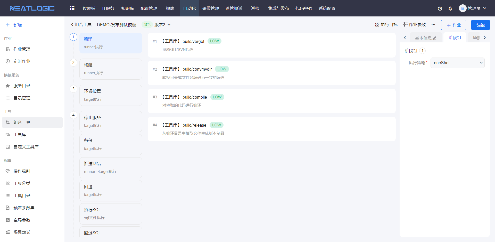
组合工具设置包含了阶段及阶段组、作业参数、连接协议、执行方式。组合工具有只读模式和编辑模式。只读模式下，点击编辑按钮可切换到编辑模式；在编辑模式下，点击取消按钮，放弃修改并切换到只读模式。
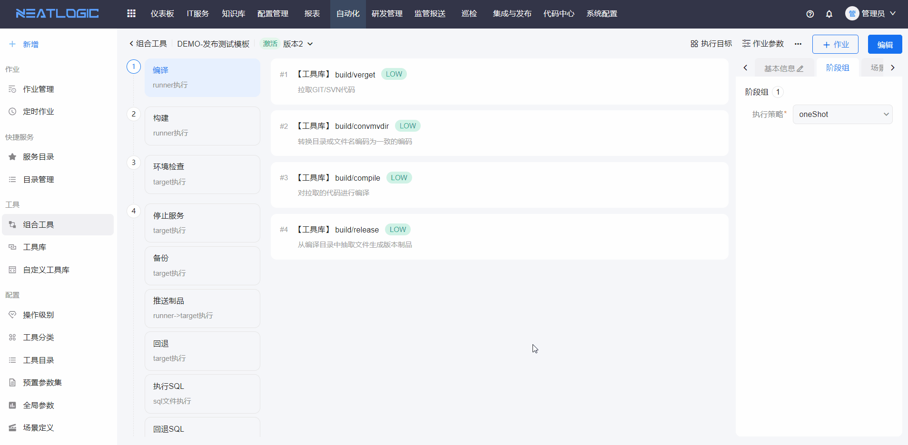

## 管理页
组合工具管理页支持添加、编辑、复制、导入和导出组合工具，以及添加作业和查看执行记录等功能。
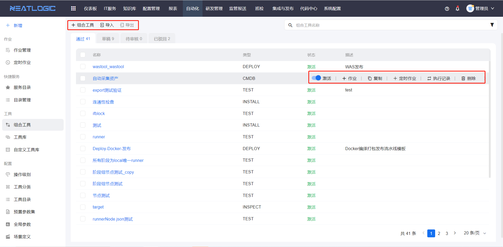
按照组合工具审批的状态分成了通过、草稿、待审核和已驳回。
草稿和已驳回的组合工具支持重新编辑并提交审核。待审核的组合工具只有有审批权限的用户可审批。
- 草稿
  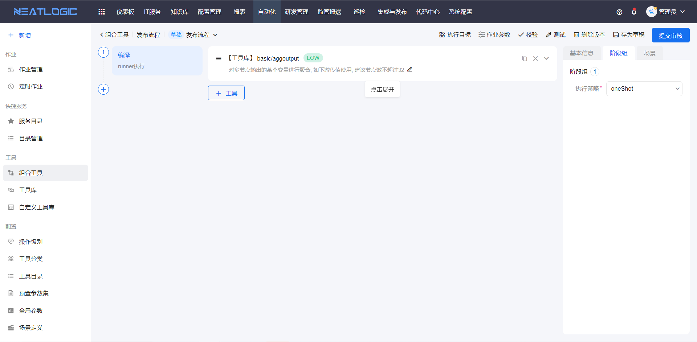
- 待审批
  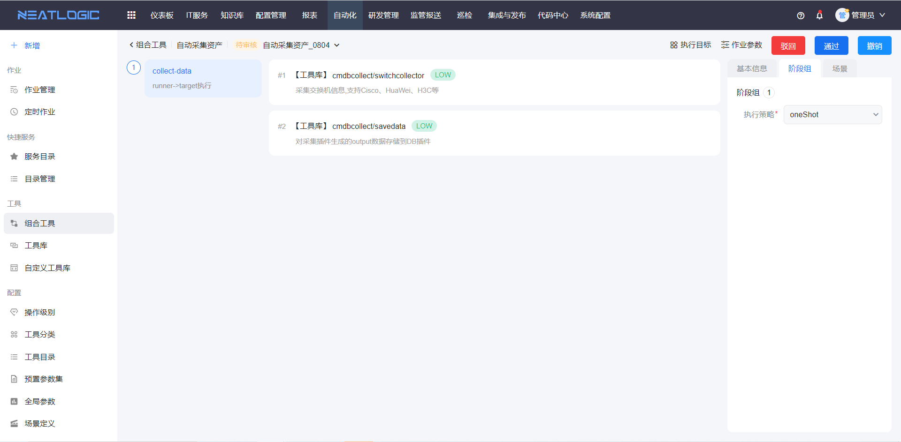
- 已驳回
  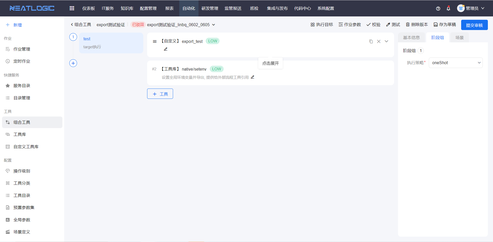

## 作业参数 
组合工具的作业参数可被阶段的参数引用，定义执行目标时，也可以引用节点信息类型的参数。

工具参数引用作业参数
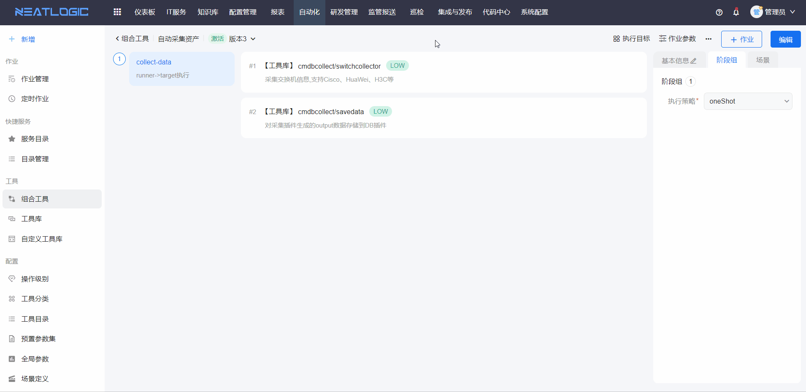
执行目标引用工具参数
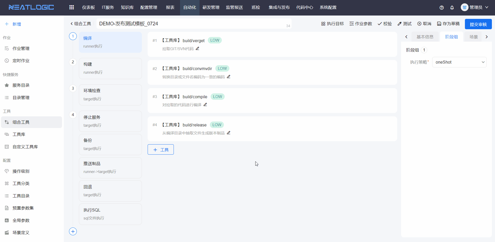
执行用户引用工具参数

## 阶段或阶段组
阶段的功能有增加、编辑、删除，阶段的配置包括名称、执行方式和预设执行目标。阶段组与阶段是包含关系，阶段组是并发阶段的组合，即同一序号下所有的阶段。

阶段组的执行策略为oneShot，由各个阶段预设执行目标，执行作业时，按照每个阶段按各自的预设执行。 
阶段组的执行策略为grayScale，阶段组的所有阶段无法预设执行目标，由阶段组统一预设目标，执行作业时，优先匹配阶段组预设执行目标执行。

添加阶段并配置阶段工具，支持[工具库](../工具库/工具库.md)和[自定义工具库](../自定义工具库/自定义工具库.md)两种工具。
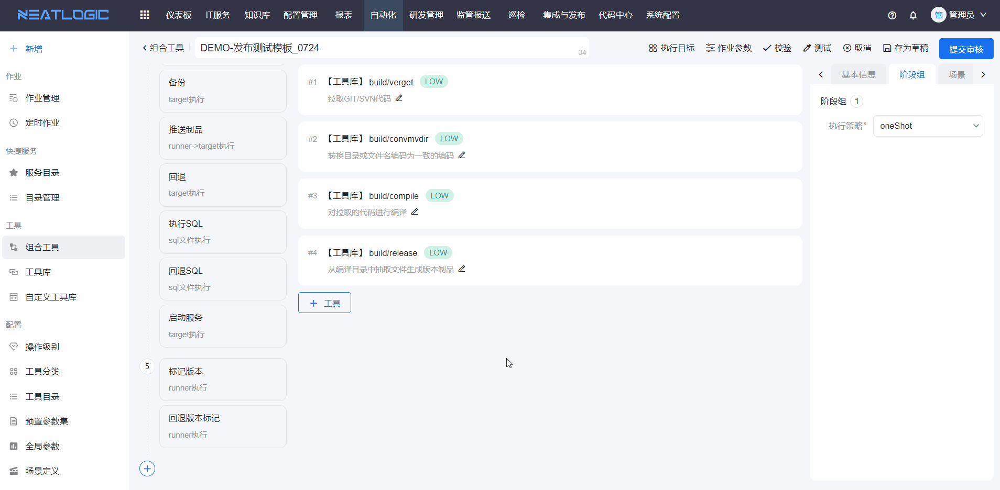
预设阶段组的执行目标
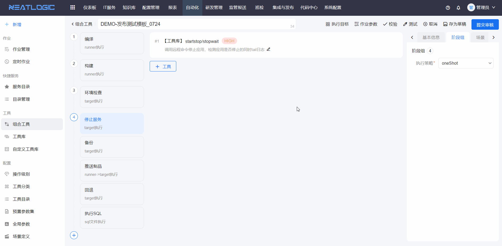

## 工具参数
阶段配置的工具或自定义工具中存在输入参数、输出参数和自由参数。

### 输入参数
工具中定义的输入参数，输入参数的映射方式总共有六种，包括常量、作业参数、上游节点输出参数值、上游节点输入参数名、为空、预置参数集。
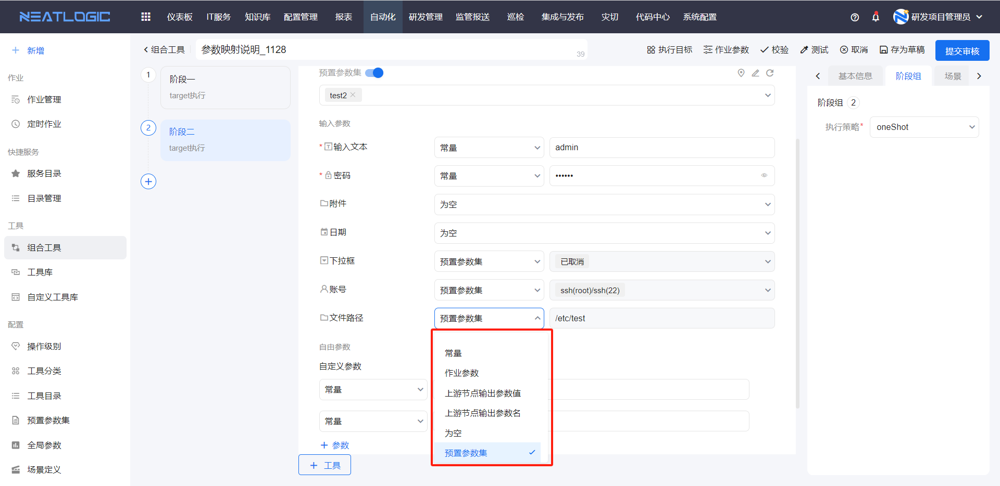
- 常量：这种方式就是管理员直接写入参数值，发起作业时不能修改。
- 作业参数：引用作业参数的参数值，支持在发起作业时才填写作业参数的值。
- 上游节点输出参数值：当前工具所在阶段有上游的阶段，或者有前置工具时，可选择引用上游节点工具的输出参数，但是可选对象有限制，只能选择类型相同的参数。
- 上游节点输出参数名：当前工具所在阶段有上游的阶段，或者有前置工具时，可选择引用上游节点工具的输出参数，没有参数类型限制。
- 为空：参数值为空，只有非必填的参数映射方式有为空。
- 预置参数集：启用关联[预置参数集](../配置/自动化配置.md#预置参数集)的工具参数可引用预置参数集的参数。

### 输出参数
工具中定义的输出参数，在组合工具编辑页面，只回显输出参数，不能做任何修改。
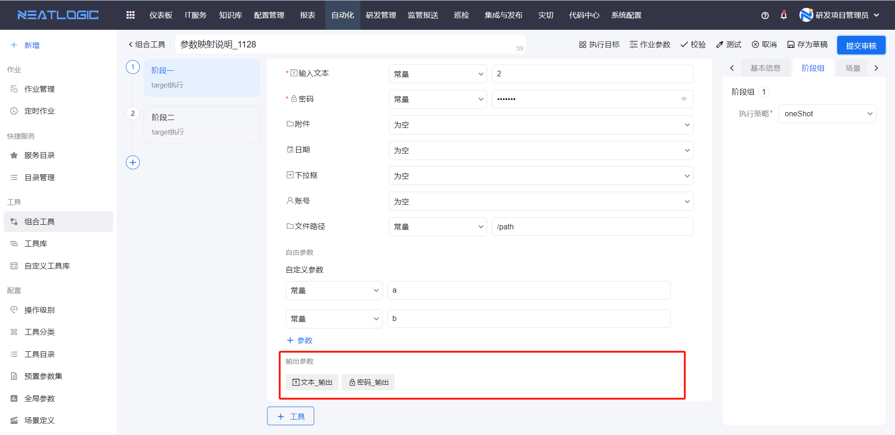

### 自由参数
自由参数主要是实现在脚本执行过程中输入参数值的场景。
自由参数的参数名要和脚本中需要输入的参数一致。
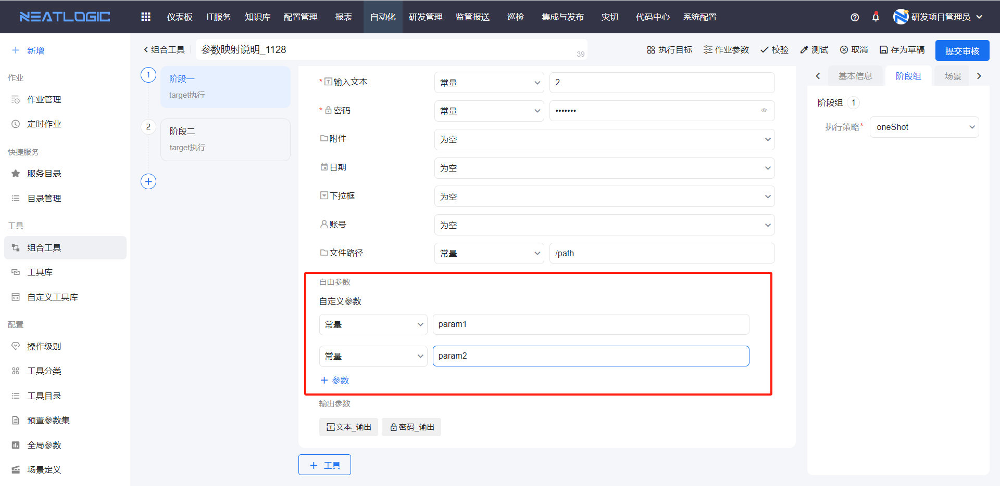

## 连接协议
连接协议可在阶段、组合工具的执行目标中预设，也支持发起作业时再指定。系统支持常见的连接协议，包括ssh、http、database、tagent、snmp、ipmi等。连接协议数据来源于资源中心的[账号管理](../../3.配置管理/资源中心/账号管理.md)

## 执行目标
执行目标配置包括选择时机和筛选方式。
### 选择时机
组合工具的执行节点设置支持预设、运行时再指定（发起作业时）、引用作业参数三个选择时机。
 
组合工具预设了执行目标节点，优先级顺序：阶段（组）>组合工具公共

未预设执行目标的阶段（组），沿用组合工具执行目标中预设的执行节点。

### 筛选方式

执行目标的筛选方式有四种，分别为过滤器、节点、输入文本和作业参数

- 过滤器：选择搜索条件，所有过滤的结果均作为执行节点。
  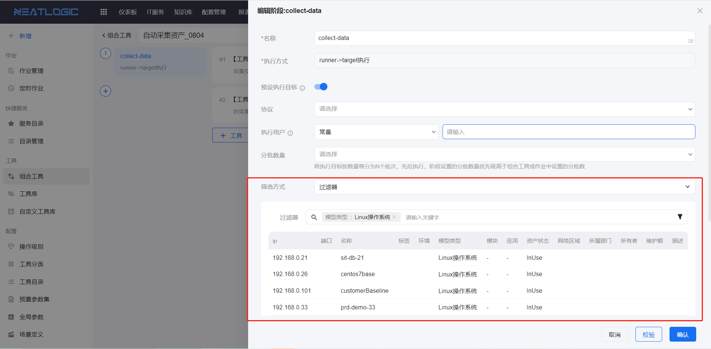
- 节点：直接在资产列表勾选目标对象作为执行节点，资产数据来自[资产清单](../../3.配置管理/资源中心/资产清单.md)。
  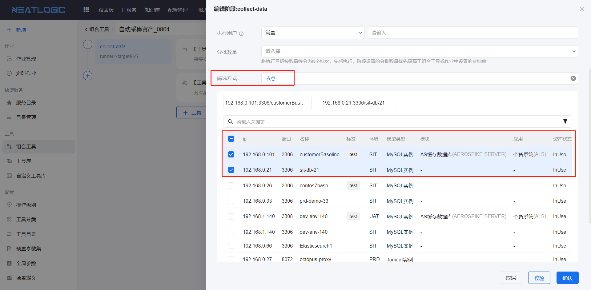
- 输入文本：在输入框中填写目标ip，一行一个ip，可在资产列表匹配到的IP才能添加为目标。
  
- 作业参数：引用节点信息类型的作业参数，这种筛选方式只有阶段和阶段组可设置。
  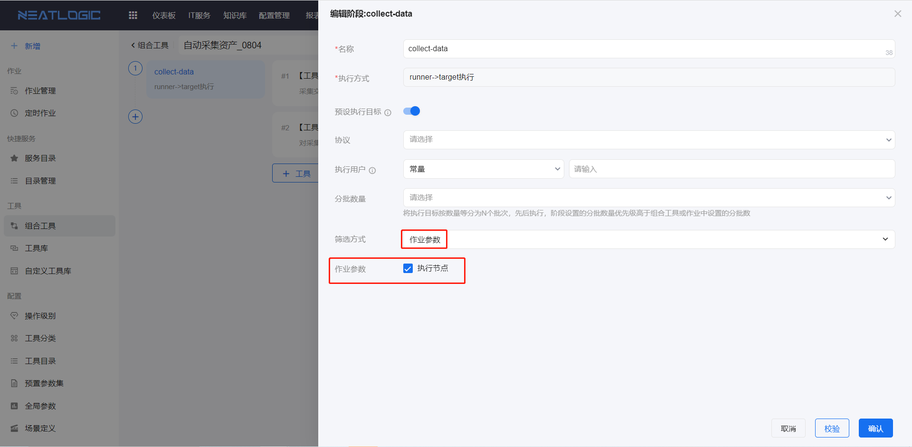

## 失败通知
组合工具基本信息中支持配置通知策略，目前仅支持作业执行失败的通知，通知策略模板在[通知策略管理](../../100.系统配置/通知策略管理.md)页面中配置。

## 操作类型
操作类型主要是控制编辑的用户可选择的执行目标范围。操作类型是和系统配置-[配置信息管理](../../100.系统配置/基础服务.md)中的“is.resourcecenter.auth”变量结合使用。
当变量的值为1时，启用操作类型功能；若变量值为0时，操作类型配置隐藏，所有资产开放。

操作类型包括查询类和操作类，这两个类型取决于用户在[团体](../../3.配置管理/系统管理/团体管理.md)中，拥有资产的只读权限还是自动化操作权限。
- 查询类：当前用户被授予了只读权限的团体中的资产（授权的模型要包括构成资产清单的模型），可以作为执行目标。
- 操作类：当前用户被授予了自动化操作权限的团体中的资产，可以作为执行目标。

## 执行方式
主要包括Neatlogic-runner节点执行和远端目标机器节点执行。
<table style="width:100%">
<thead>
    <tr>
        <td>执行方式</td>
        <td>唯一名</td>
        <td>插件特点</td>
        <td>概要描述</td>
    </tr>
</thead>
<tbody>
    <tr>
        <td>runner节点执行</td>
        <td>runner</td>
        <td>1、需安装第三方介质，如：网段扫描 
            2、对操作系统的依赖包比较重，如；发布的编译、构建等。
        </td>
        <td>Neatlogic-runner节点上执行，也可以简称本地执行。</td>
    </tr>
    <tr>
        <td>runner到远端目标执行</td>
        <td>runner_target</td>
        <td>1、需安装第三方介质，如：网络设备采集、存储采集。 
            2、对操作系统的依赖包比较重，如；虚拟机采集。
            3、插件需要动态获取执行节点的必要参数，如：IP、端口、账号、密码等。
        </td>
        <td>Neatlogic-runner节点上执行，也可以简称本地连远端目标节点执行。</td>
    </tr>
    <tr>
        <td>远端目标节点执行</td>
        <td>target</td>
        <td>依赖比较少或简单的依赖，如：操作系统采集。</td>
        <td>目标节点上执行。</td>
    </tr>
    <tr>
        <td>SQL执行</td>
        <td>SQL执行</td>
        <td>数据库脚本执行。</td>
        <td>runner节点上执行。</td>
    </tr>
</tbody>
</table>