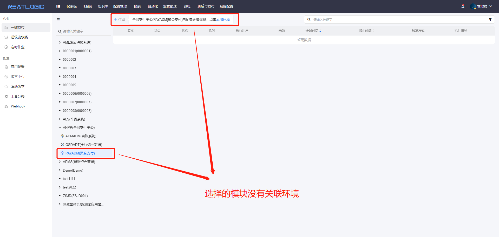
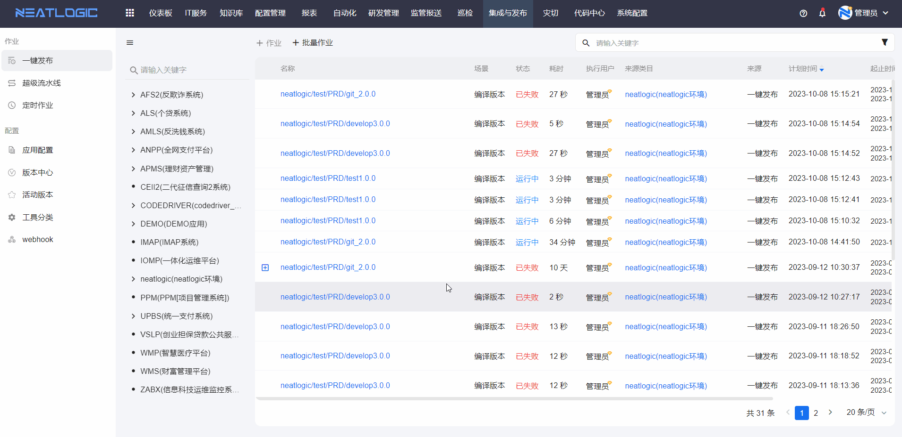
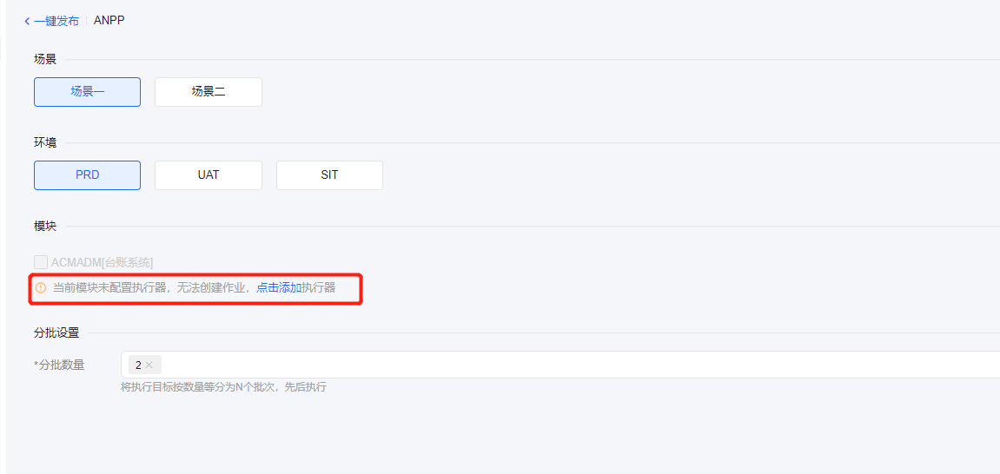
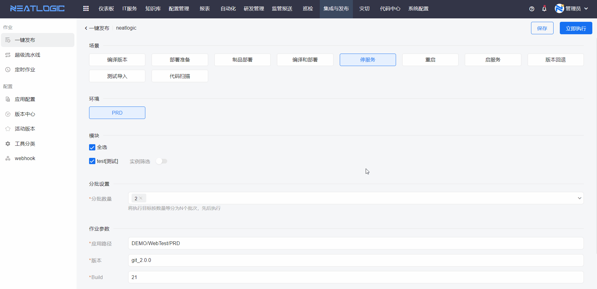
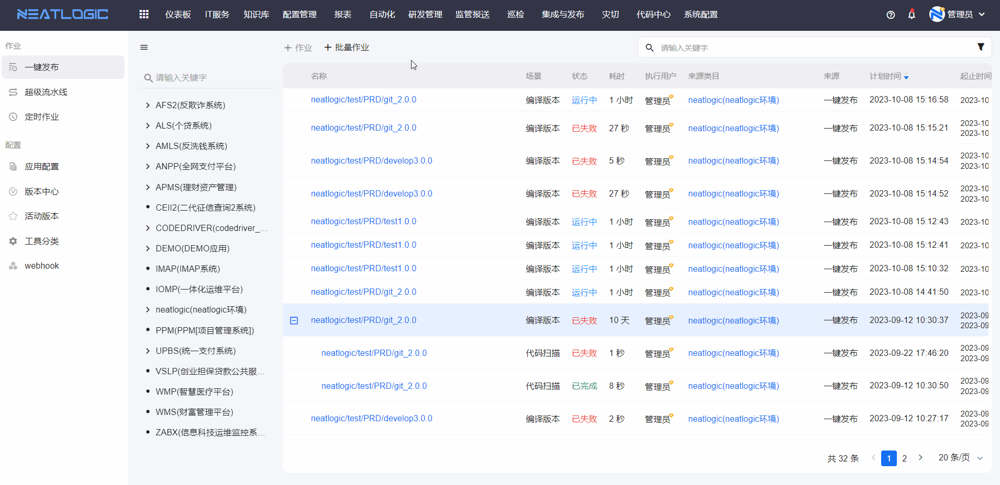
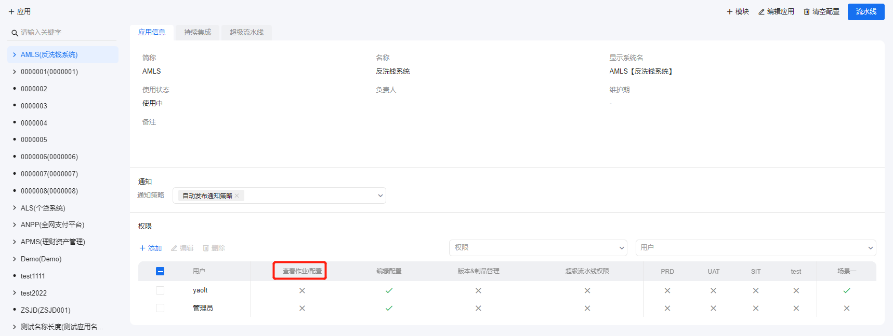
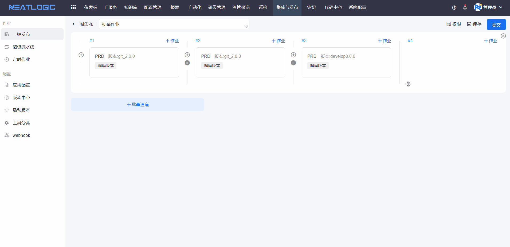

# 一键发布
一键发布页面是发起发布作业的页面，发起作业的方式支持发起单个作业和批量作业两种。

## 发起单个作业
发起单个作业时，用户首先选择能发起作业应用或模块，否则添加作业的入口禁用。

以下情况选择应用或模块后不支持发起作业
- 选择应用，应用未关联模块
  
- 选择应用，应用配置了模块，但是所有模块都未关联任何环境
  
- 选择模块，模块未关联环境
  

正常发起发布作业操作

应用模块未配置执行器时，显示快捷添加执行器操作入口。

当前已选的场景中包含构建（Build）类型的工具，已选的模块需要选择构建版本（Buildno），版本来源于[版本中心](../6.集成与发布/版本中心.md)。

## 批量作业
批量作业是添加一个作业集合，作业集合中包含两个及以上的作业，支持直接手动创建和通过超级流水线创建两种方式。批量作业的特点：批量执行、批量验证。

### 创建批量作业
直接创建的方式，通过添加批量通道，选择已保存的发布作业作为子作业。

### 批量执行
通过超级流水线模板创建批量作业

## 查看作业
点击作业名称，跳转到作业详情页面

## 相关权限说明

1. 用户有自动发布管理权限时，拥有执行集成和发布模块所有页面的资源和操作权限。
2. 用户无自动发布管理权限时，有发布基础权限，才能查看一键发布页面。
3. 用户有发布基础权限同时被授予应用的查看作业/配置权限，才能通过对应的应用发起作业。
   
4. 用户有批量发布审核权限和批量发布管理权限时，可创建和删除批量发布作业。
5. 用户有批量发布审核权限时，才能审核批量发布作业
6. 用户有批量发布管理权限，或者被授权了批量作业的执行权限，可以执行批量发布作业。
   