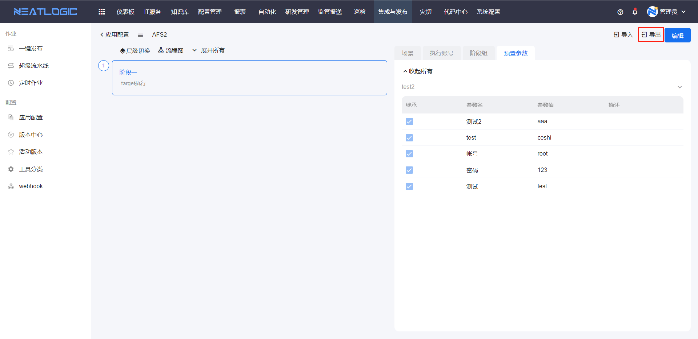
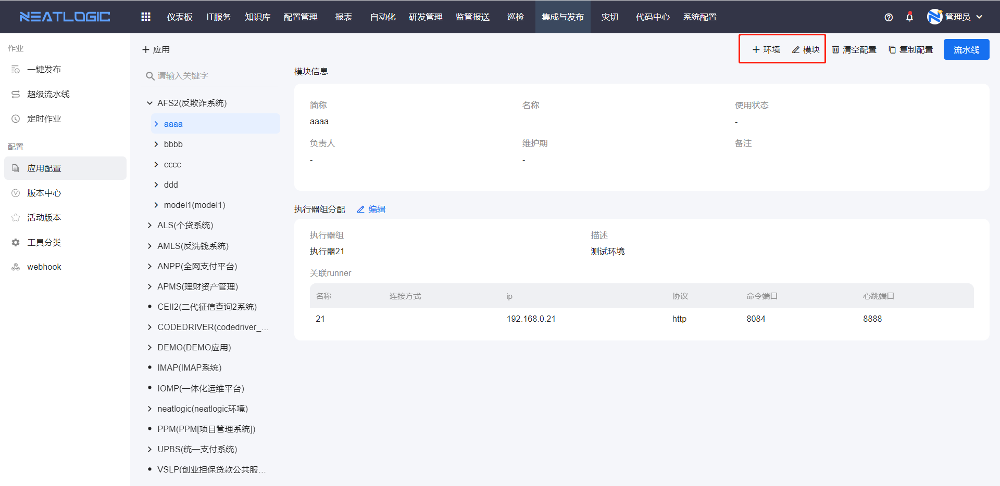
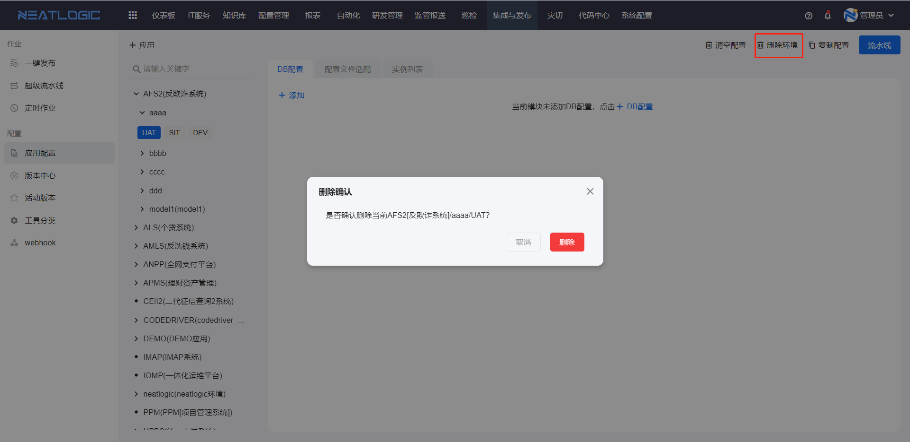

# 应用配置
首先介绍应用、模块和环境的关系，应用、模块和环境数据都来源于配置管理，分别对应模型是应用系统、应用模块、应用环境，应用包含模块，模块包含应用。

应用配置是集成发布最核心的配置页面，在应用层来配置发布流水线（发布的脚本），模块层、环境层在继承上一级的流水线的基础上，支持重定义脚本，此外应用层还包括持续集成和超级流水线配置，应用层还支持进行资源授权，模块层可以定义执行器，环境层设置DB配置、配置文件和实例。

相关权限：系统配置-权限管理-应用配置维护权限

## 流水线
流水线是指发布的脚本工具集合，与组合工具一样，由阶段（组）、工具、作业参数、场景、连接协议和执行用户等组成，以上配置具体介绍可参考[组合工具](../5.自动化/组合工具/组合工具.md)。

应用流水线支持两种配置方式：[引用组合工具模板](#引用模板)和[导入流水线配置](#导入流水线配置)

### 引用模板
步骤：应用层点击流水线模板-选择工具-编辑流水线-预置参数-场景设置-执行用户-执行器

### 导入流水线配置
导入流水线的应用场景主要是，从其他环境或者租户中，导出应用的流水线配置，然后再导入到当前环境的同名的应用中，导入时自动把依赖的配置一起导入到系统中。

导出

导入，本地存在同名的依赖配置，可自定义选择是否覆盖

## 应用层
1. 应用层支持编辑应用数据和添加子模块数据，还支持添加应用持续集成配置和应用超级流水线。

2. 通知，配置发布失败后的通知策略，策略来源于系统配置-通知策略管理。

3. 授权，应用层可对应用的操作、环境、场景进行授权。

## 模块层
1. 模块层支持编辑模块数据和添加环境。

2. 模块层可以在应用层基础上重定义流水线。

3. 复制配置，将当前模块的流水线配置复制到相同应用下其他未重定向的模块，或者添加新模块并复制当前模块配置。

4. 执行器组分配，在模块下的实例远程执行脚本时使用执行器组中的runner。若未分配执行器组，无法发起需要远程执行的发布作业。

5. 清空配置，清空当前模块重定向的配置，恢复为应用层的默认配置。

## 环境层
1. 删除环境，是指解除模块和当前环境的关联关系，不是物理上删除环境数据。

2. DB配置
3. 配置文件适配
4. 实例列表
5. 清空配置，清空当前环境重定向的配置，恢复为模块层的默认配置。
6. 复制配置，将当前环境的流水线配置复制到相同模块下其他未重定向的环境，或者添加新模块并复制当前环境配置。