# 应用配置
首先介绍应用、模块和环境的关系，应用、模块和环境数据都来源于配置管理，分别对应模型是应用系统、应用模块、应用环境，应用包含模块，模块包含应用。

应用配置是集成发布最核心的配置页面，在应用层来配置发布流水线（发布的脚本），模块层、环境层在继承上一级的流水线的基础上，支持重定义脚本，此外应用层还包括持续集成和超级流水线配置，应用层还支持进行资源授权，模块层可以定义执行器，环境层设置DB配置、配置文件和实例。

相关系统权限：系统配置-权限管理-应用配置维护权限 & 自动发布管理权限
1. 自动发布管理权限范围最大，拥有这个权限的用户可以执行继承和发布模块所有的操作，没有数据范围限制。
2. 应用配置维护权限是应用配置页面最基础的权限，拥有这个权限的用户可以访问应用配置的页面，并对有数据权限的应用执行操作，应用数据权限的详情参考 [应用层](#应用层)-4.授权。

## 流水线
流水线是指发布的脚本工具集合，与组合工具一样，由阶段（组）、工具、作业参数、场景、连接协议和执行用户等组成，以上配置具体介绍可参考[组合工具](../5.自动化/组合工具/组合工具.md)。

应用流水线支持两种配置方式：引用组合工具模板和导入流水线配置.

### 引用模板
步骤：点击应用层流水线模板-选择工具-编辑流水线-预置参数-场景设置-执行用户-执行器

1. 流水线工具来源于自动化-[组合工具](../5.自动化/组合工具/组合工具.md)
2. 选择完组合工具后，回显组合工具的所有阶段和工具及其参数配置，然后再根据当前场景需求修改流水线。应用层支持任意增删改阶段、工具和参数操作，模块和环境层若要修改，需启用修改对象的重定向设置。
3. 预置参数步骤，若工具引用了预置参数集，这个步骤会回显当前流水线引用的所有预置参数集，并支持重新修改预置参数集的参数映射值。
4. 场景是基于整个流水线基础上，选择部分阶段作为发布场景，支持发布作业使用，所以流水线的场景不能为空。
5. 执行用户步骤设置目标机器的连接协议和执行用户。
6. 执行器即runner执行器，更多详情参考[Tagent服务](../5.自动化/Tagent服务/Tagent服务.md)。

### 导入流水线配置
导入流水线的应用场景主要是，从其他环境或者租户中，导出应用的流水线配置，然后再导入到当前环境的同名的应用中，导入时自动把依赖的配置一起导入到系统中。

导出

导入，本地存在同名的依赖配置，可自定义选择是否覆盖
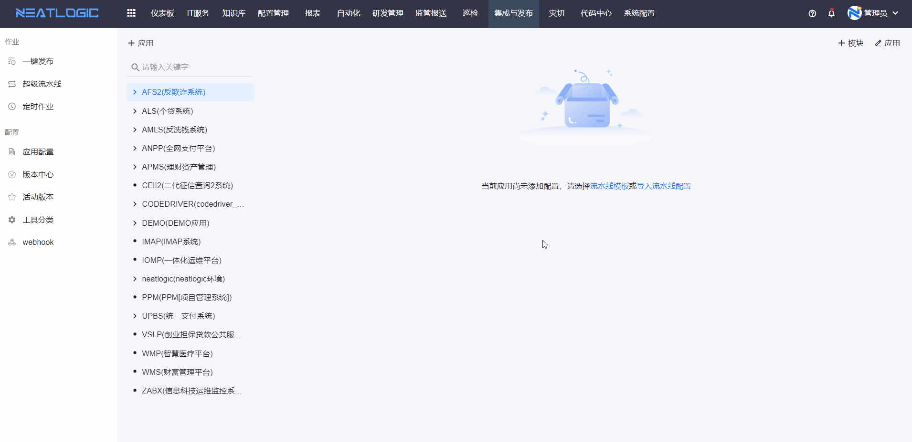

## 应用层
1. 应用层可以重新编辑流水线，流水线修改后，可暂存为草稿.
   
   再次编辑流水线时可选择继续编辑草稿。
   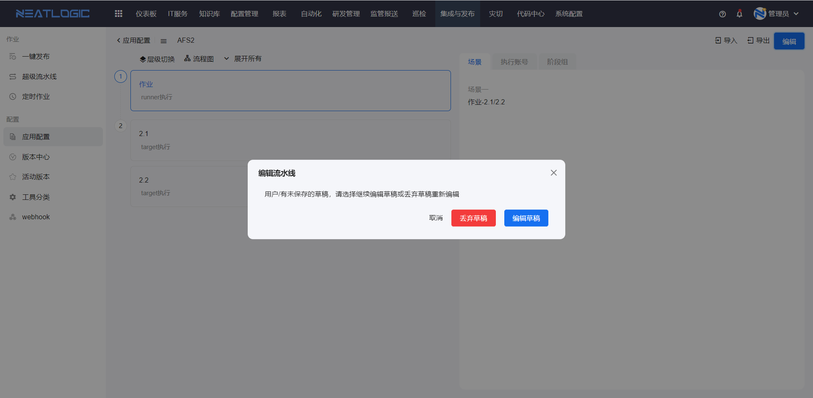
2. 应用层支持编辑应用数据和添加子模块数据，另外新增的应用的权限列表中会自动添加一条授权信息，授权的对象是添加应用的用户，即添加应用的用户默认就有应用的所有权限。

3. 通知，配置发布失败后的通知策略，策略来源于系统配置-通知策略管理。
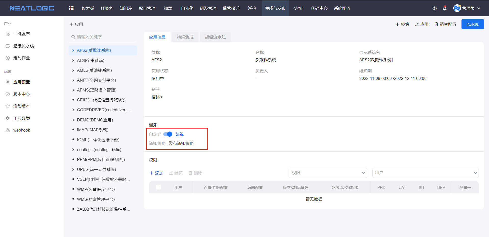

4. 授权，应用层可对应用的操作、环境、场景进行授权，应用未授权时，默认所有用户都能看到该应用的配置。
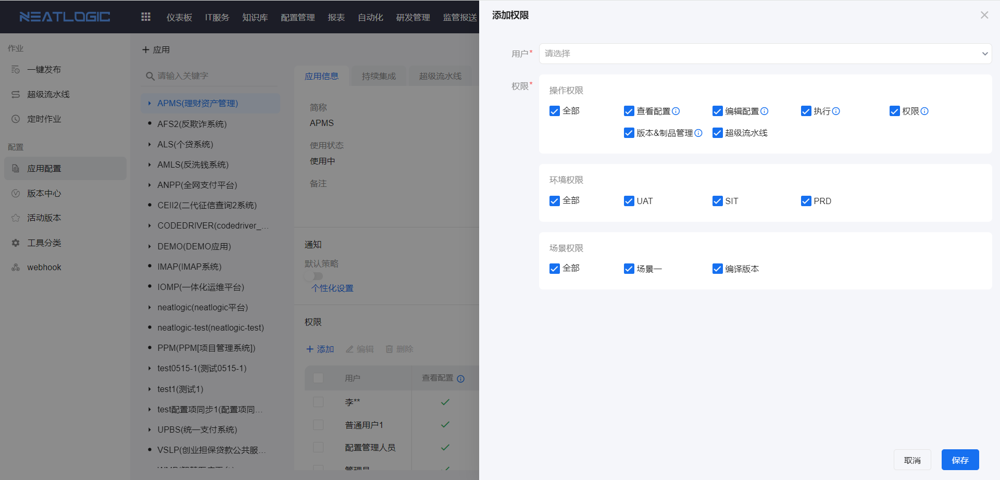
   - 查看配置权限：在应用列表中，控制应用是否显示。
      
      授权给用户查看配置权限后，仅授权对象可以看到该应用，并查看应用及下级模块、环境的配置；
      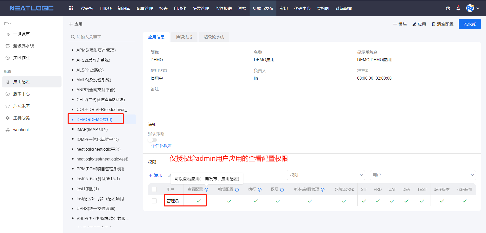
      未被授权的用户查看应用配置时，应用列表不显示该应用。
      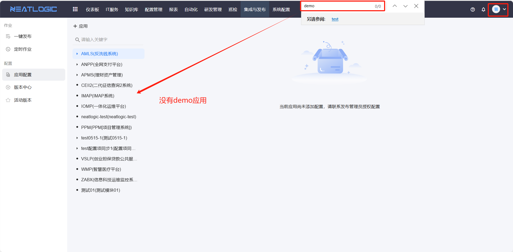

   - 编辑配置权限：在应用配置页面，控制用户能否编辑应用配置；默认包含了查看配置权限执行权限。

      授权给用户编辑，用户可编辑应用的配置。若用户无应用的编辑配置权限，编辑操作隐藏或禁用。
      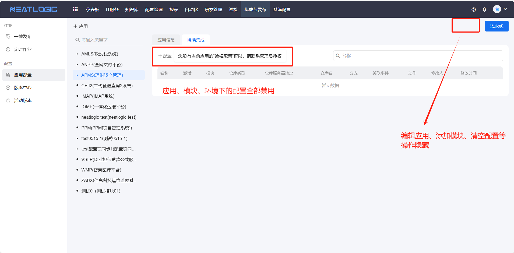

   - 执行权限：在一键发布页面，控制应用是否能够执行作业

      用户缺少应用的执行权限时，在一键发布页面无法发起该应用的作用。
      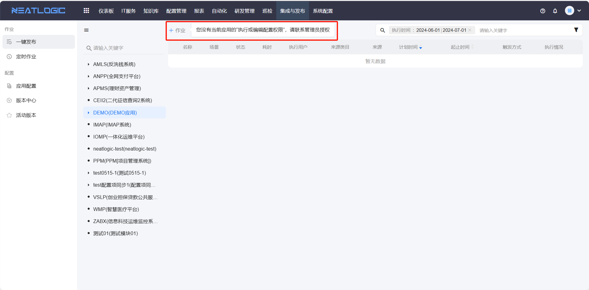

   - 版本&制品管理权限：在版本中心页面，控制是否能够对应用的版本和制品进行管理操作。
      
  
   - 超级流水线权限：在应用配置页面，控制是否能够管理应用的超级流水线。
      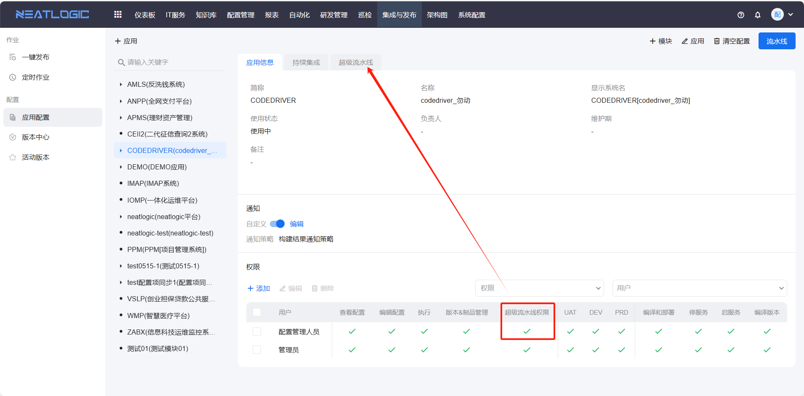
      
  
   - 环境权限：在发起发布作业时，控制是否能够选择对应的环境。
      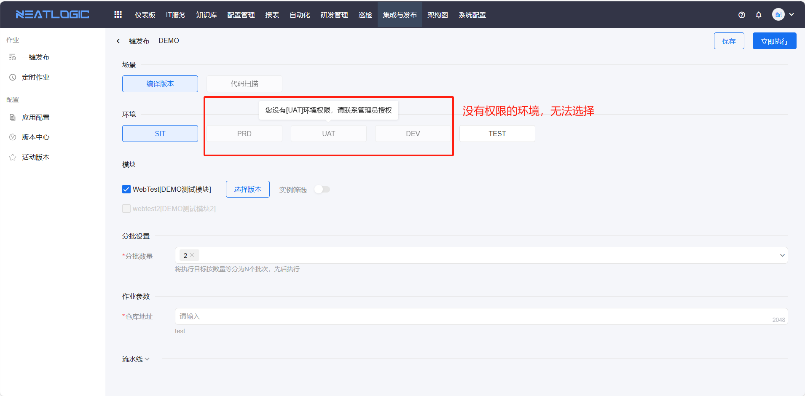

   - 场景权限：在发起发布作业时，控制是否能够选择对应的场景。
      

5. 支持配置配置持续集成，持续集成是指在特定事件下触发发布作业的配置，支持添加、编辑、删除和搜索配置等操作。
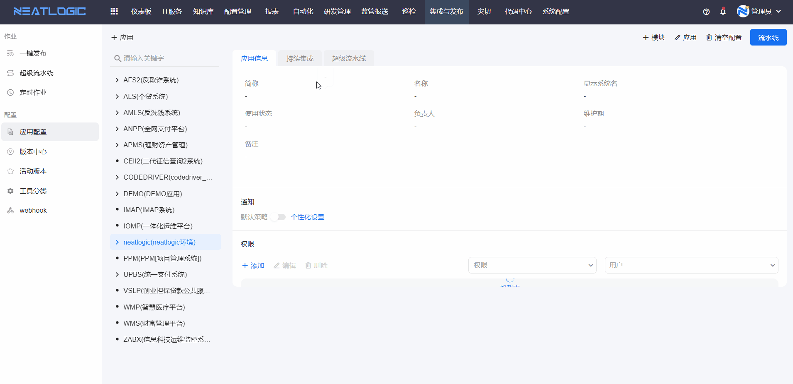
   
6. 支持配置应用超级流水线，即预设当前应用的批量发布作业模板，支持添加、编辑、删除、发起批量作业和查看作业列表等操作。
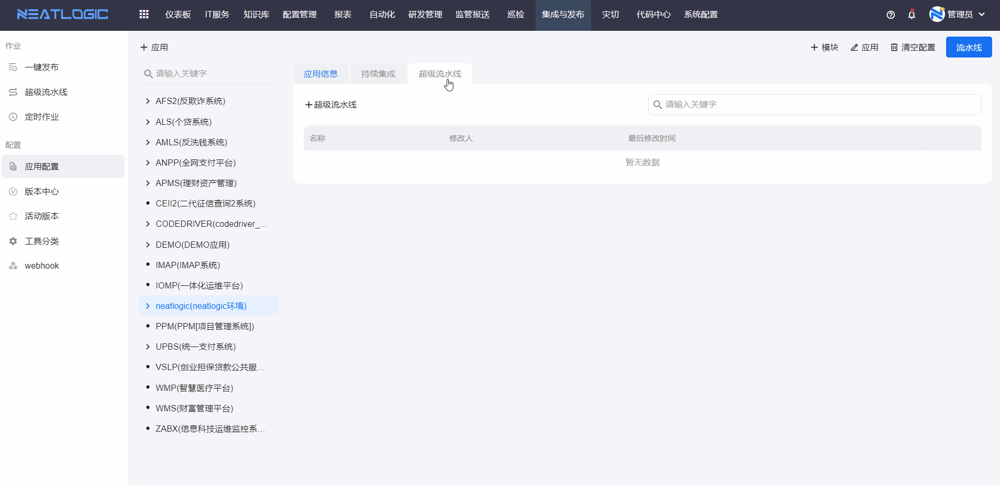

## 模块层
1. 模块层支持编辑模块数据和添加环境。

2. 模块层可以在应用层基础上重定义流水线。支持可以添加、删除、修改和禁用阶段或工具，支持重定义预置参数集、执行账号、阶段组和作业参数。
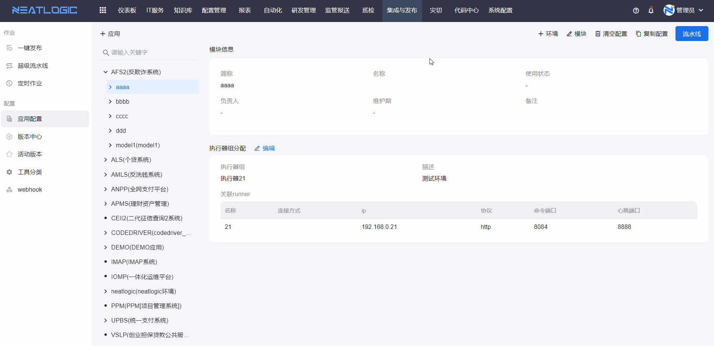

3. 复制配置，将当前模块的流水线配置复制到相同应用下其他未重定向的模块，或者添加新模块并复制当前模块配置。

4. 执行器组分配，远程在实例上执行脚本时使用模块层执行器的runner。若模块层未分配执行器，无法发起发布作业。

5. 清空配置，清空当前模块重定向的配置，恢复为应用层的默认配置。

## 环境层
选中应用模块下关联的环境，页面切换到环境配置，环境配置页面支持配置环境的DB配置、配置变量及变量实例差异、实例列表。
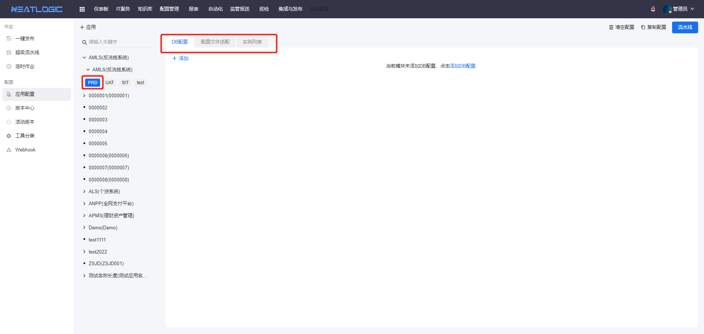
1. 删除环境，是指解除模块和当前环境的关联关系，不是物理上删除环境数据，环境的数据来源于[全局属性](../3.配置管理/系统管理/全局属性管理.md)中的“应用环境”属性。

2. DB配置：DB配置有添加、编辑和删除操作，数据库对象来源于资产清单的数据库实例，账号来源于已选数据库实例配置的账号
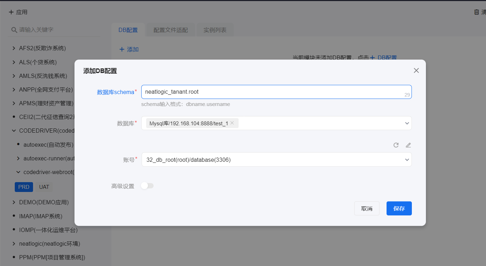
3. 配置文件适配，配置文件适配中支持配置环境的公共变量，环境包含的实例支持重定义变量值。
   
   添加公共变量，变量可定义类型，支持文本和密码类型。
    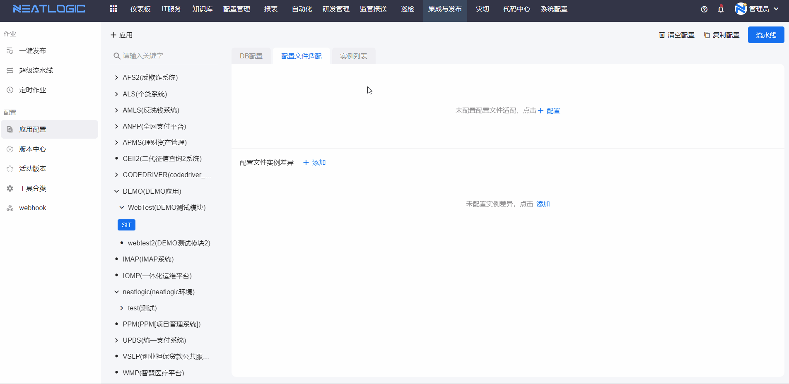
   在实例中，重新定义变量值
    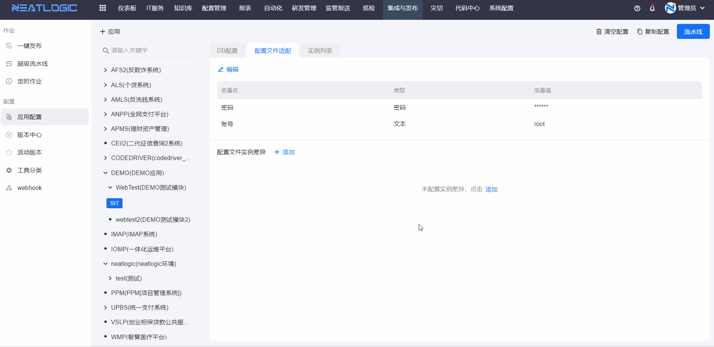
4. 实例列表，添加实例的方式有两种，新增实例或者关联已有实例

    新增实例
    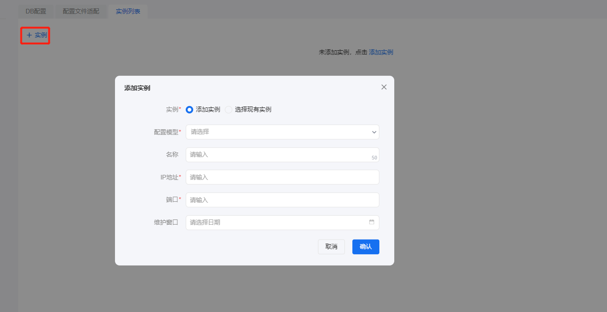
    关联已有实例
    

5. 清空配置，清空当前环境重定向的配置，恢复为模块层的默认配置。
6. 复制配置，将当前环境的流水线配置复制到相同模块下其他未重定向的环境，或者添加新模块并复制当前环境配置。