# 项目应用功能
项目包括迭代、需求、缺陷和任务等应用，下面主要介绍迭代和需求功能。

## 迭代
迭代主要是用于按照阶段管理项目的事务，比如说把一个月作为一个阶段频次来管理待办需求、任务和缺陷，当所有的事务都关闭后，迭代才算完成。

迭代完成度100%的效果如图所示。
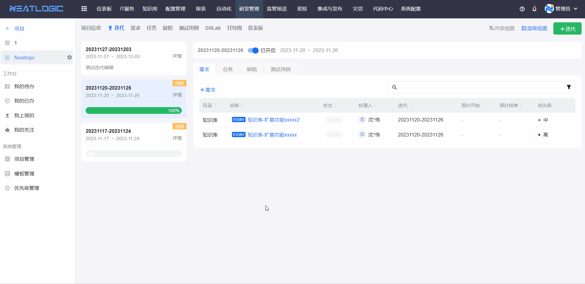
### 添加迭代
在迭代页面，点击添加迭代，填写迭代信息并保存即可。
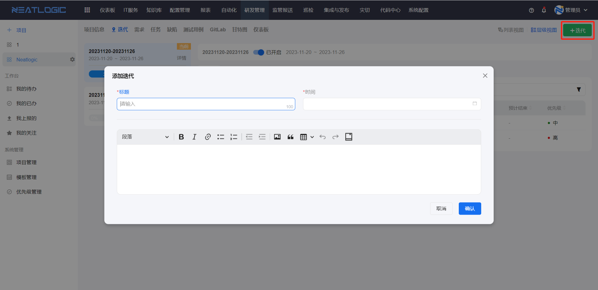

### 编辑迭代
在迭代详情页面，点击编辑按钮，修改基本信息并保存即可。
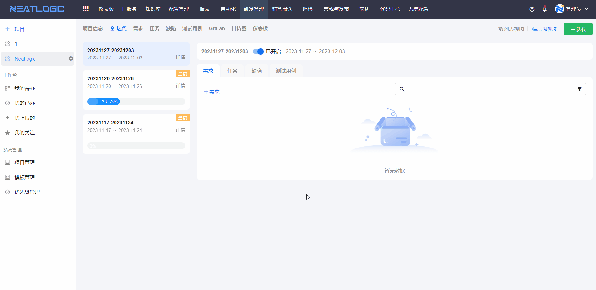

### 关闭迭代
迭代列表上有个开启按钮，点击后，迭代关闭，并且左侧迭代列表自动移除已关闭的迭代。

### 管理迭代的事务
在迭代中可以添加和删除需求、任务、缺陷和测试用例，这是直接添加的方式。
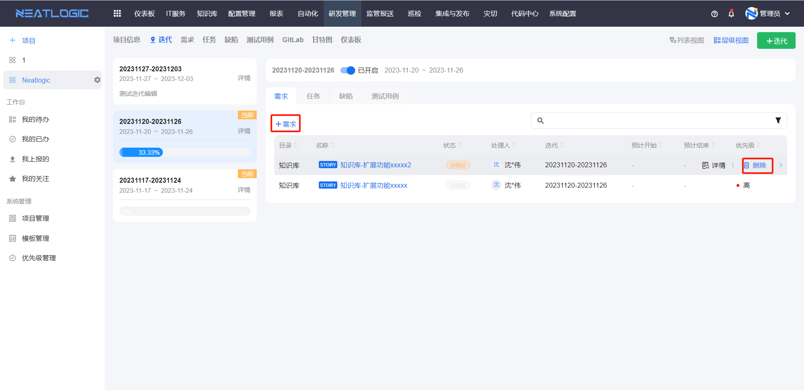
另外可以在需求、缺陷的详情页面，在迭代下拉框中选择目标迭代，保存后，相应的需求、缺陷等就会加入到迭代中。

## 需求
需求页面包括了目录和需求列表。

### 需求目录
需求目录是用于需求分类，支持添加、删除和编辑。
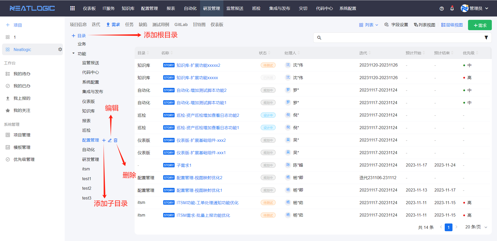

### 需求列表
需求列表默认是以列表模式展示，还支持切换成故事墙和甘特图的模式。
- 故事墙：从需求的状态的维度来展示需求。
  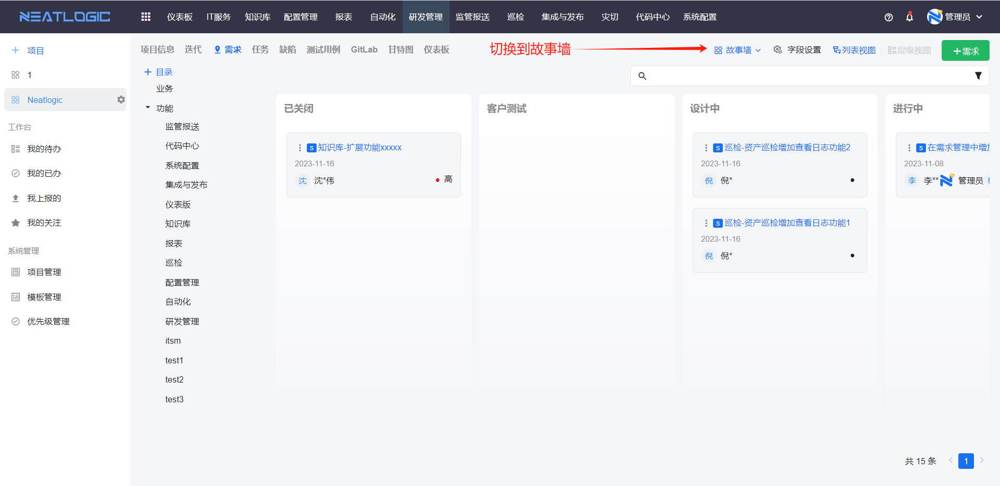
- 甘特图：从需求的计划时间的角度来展示需求。
  

### 字段设置
表格的字段可以通过字段设置来修改字段的排序和显示方式。
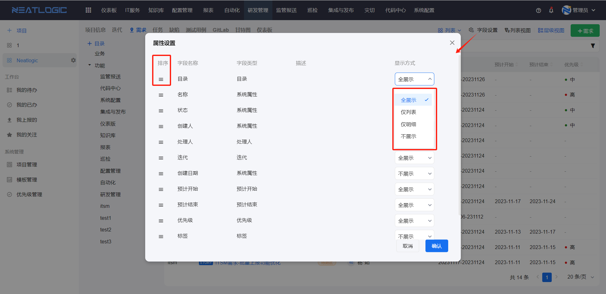

### 添加需求
在需求列表，点击添加按钮，填写需求的信息并保存即可，需求中间那部分是需求的属性，属性由项目的[应用设置](../7.研发管理/项目管理.md/#编辑项目)控制。
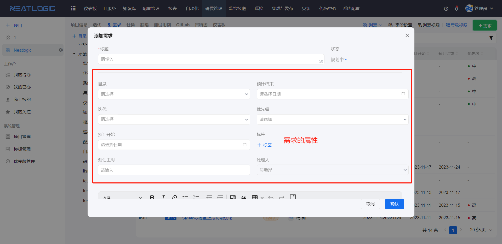

### 需求流转
需求处理主要表现在状态流转，打开需求的详情页面，选择下一状态，点击流转按钮即可完成状态流转。
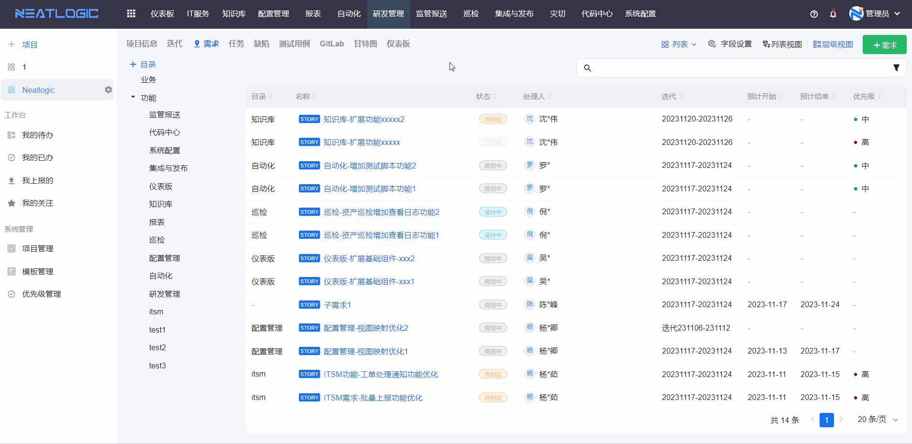

### 编辑需求
在需求的详情页面支持修改需求属性和基本信息，但是前提条件是需求的状态不是[结束状态](../7.研发管理/模板管理.md/#状态设置)。

### 关联任务、缺陷
需求支持关联任务、缺陷等，在需求的详情页面，可以快速添加任务、缺陷，也支持关联已有的任务、缺陷。
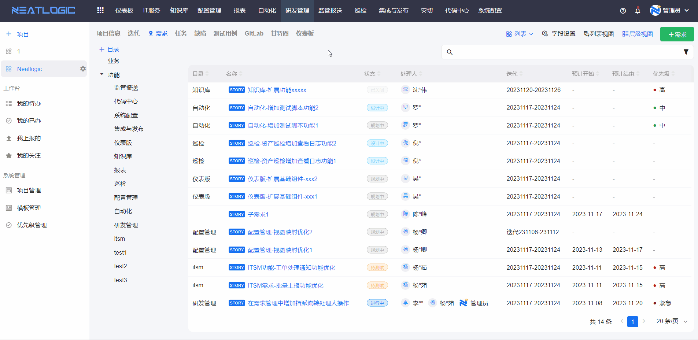

### 关联gitlab
在gitlab中提交代码，并把需求的源码关键字复制到提交代码的message中，需求的gitlab提交中生成相应的提交记录。Gitlab配置参考[模板管理](../7.研发管理/模板管理.md/#gitlab)

在需求详情中复制源码关键字，如图所示。
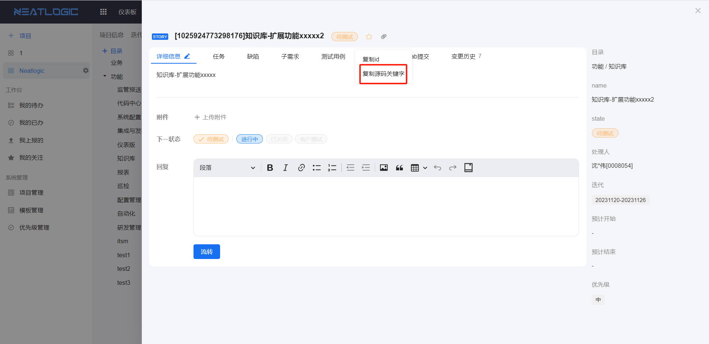

### 花费
需求花费的功能是与需求的预估工时结合使用。在需求列表中会根据花费的时间在需求预估工时的占比，计算一个需求完成百分比。

举个例子，下图中的需求预估工时为20，，花费时间为0，当前完成度为0%。
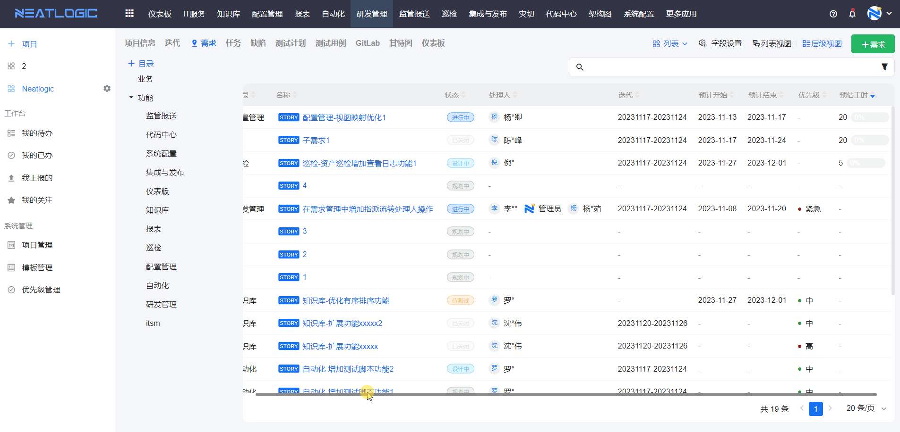
添加一个5工时的花费
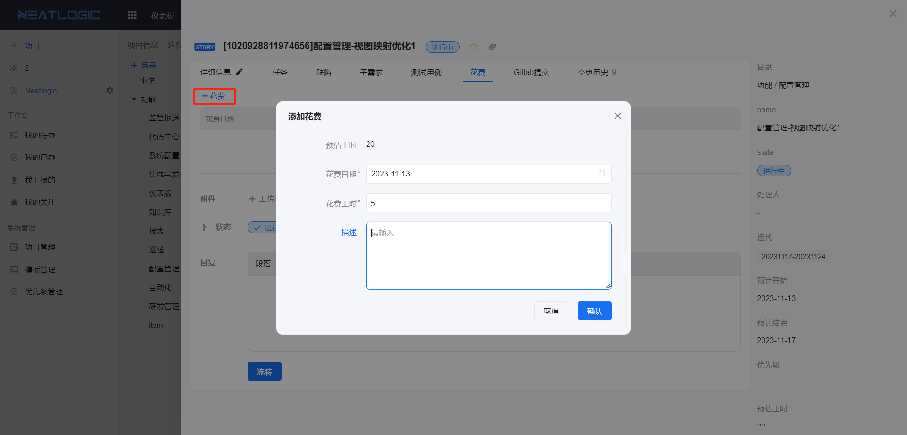
需求完成度更新为25%

## 仪表版
项目支持配置基于研发管理模块数据的仪表版，数据源来自[数据仓库](../100.系统配置/数据仓库.md)。

项目的仪表版的配置详情可参考[仪表版](../1.仪表板/仪表板.md/#添加仪表板)。

仪表板效果预览如图。
