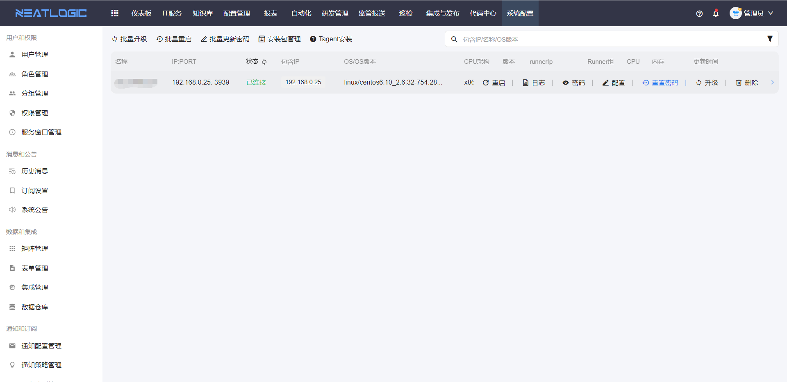
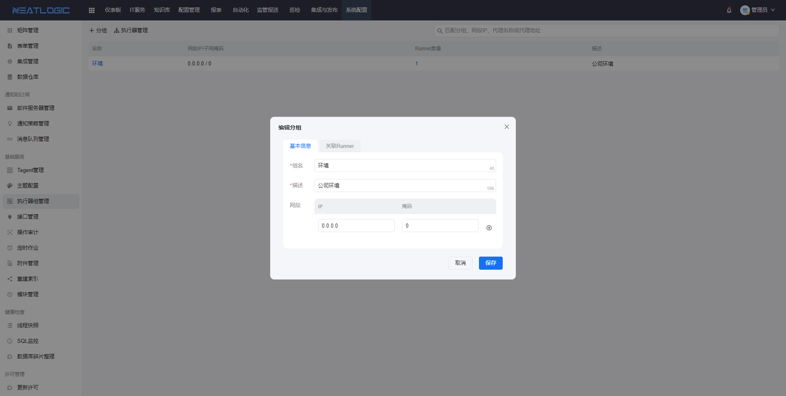

# 关于Tagent服务
Neatlogic-Tagent用于部署在受管目标操作系统上，平滑替代主机连接协议一种可选方式，适用的场景：

1. Windows类机器。
2. 机器账号密码经常变更。
3. 机器上多账号，不想在平台上维护不同用户密码。
4. 深度使用自动化运维，如：资源安装交付。

# Tagent安装
安装步骤：获取安装包-在目标受管机器安装

## 获取安装包
Neatlogic-Tagent两种获取安装包：
- 基于[Neatlogic-tagent-client](https://gitee.com/neat-logic/neatlogic-tagent-client)工程打包。
```
说明：windows安装包内嵌了Perl运行时依赖环境和7z工具，详见下面安装包内差异。
```
- 从[Neatlogic-runner](https://gitee.com/neat-logic/neatlogic-runner)获取安装包
```
#####安装包说明############
#Neatlogic-runner 自带3个安装包
#Unix类：tagent.tar
#Windows 32类：tagent_windows_x32.zip
#Windows 64类：tagent_windows_x64.zip
##########################
#eg:获取Unix安装包
# 格式: http://Neatlogic-runner机器IP:8084/autoexecrunner/tagent/download/tagent.tar
# 示例
curl tagent.tar http://192.168.0.10:8084/autoexecrunner/tagent/download/tagent.tar

#eg: 获取Windows 64位安装包
# 示例
curl tagent_windows_x64.zip http://192.168.0.10:8084/autoexecrunner/tagent/download/tagent_windows_x64.zip
```

## 安装
- Unix类操作系统建议以root用户安装，root安装的Agent会注册服务。
- Windows操作系统需以管理方式打开cmd窗口进行安装。

### 手动安装
- Linux | SUSE | Aix |Unix 类安装
```
# 登录目标受管机器，下载安装包,建议统一存放/opt目录
cd /opt
curl tagent.tar http://192.168.0.10:8084/autoexecrunner/tagent/download/tagent.tar

# 解压
tar -xvf tagent.tar

# 查看shell类型
echo $0 #aix操作系统需注意,大多数默认是ksh

# 执行安装
# 参数说明：--serveraddr neatlogic-runner的访问地址  --tenant 租户名称
# shell类型是bash，示例
sh tagent/bin/setup.sh --action install --serveraddr http://192.168.0.10:8084  --tenant demo

# shell类型是ksh，示例
sh tagent/bin/setup.ksh --action install --serveraddr http://192.168.0.10:8084  --tenant demo

# 安装完检查 (3个进程)
ps -ef |grep tagent 

# 查看日志
less tagent/run/root/logs/tagent.log 
# 查看配置 
less tagent/run/root/conf/tagent.conf

#启停
service tagent start/stop 
```

- Windows类型安装
  
1. 查看Windows操作是多少位OS，选择对应安装包。
2. 登录目标受管机器，下载安装包并拷贝到c盘,建议统一存放c盘根目录。
3. 以管理员权限打开cmd窗口，并切换到c盘目录
4. cd tagent_windows_x64目录，执行：service-install.bat

示例：
```
cd c:\tagent_windows_x64
service-install.bat
```

### 自动安装

- Linux | SUSE | Aix |Unix 类安装示例
```
# 定义runner变量
RUNNER_ADDR=http://192.168.0.10:8084 #Neatlogic-runner的IP和端口
cd /opt
# 下载安装脚本
curl -o install.sh $RUNNER_ADDR/autoexecrunner/tagent/download/install.sh

# 执行安装
bash install.sh --tenant demo --pkgurl $RUNNER_ADDR/autoexecrunner/tagent/download/tagent.tar --serveraddr $RUNNER_ADDR
```

-Windows类安装示例
```
# 打开浏览器输入runner地址下载install.vbs，如：http://192.168.0.10:8080/autoexecrunner/tagent/download/install.vbs
# 以管理员打开cmd窗口
# 切换install.vbs所在目录，或拷贝install.vbs到"%Temp%"目录
# 执行安装
set RUNNER_ADDR=http://192.168.0.10:8084
cscript install.vbs /tenant:demo /pkgurl:%RUNNER_ADDR%/autoexecrunner/tagent/download/tagent_windows_x64.tar /serveraddr:%RUNNER_ADDR% 
```

# Tagent卸载
- Linux | SUSE | Aix |Unix 类服务卸载
```
cd /opt 

# 查看Shell类型
echo $0

# Shell为bash
sh tagent/bin/setup.sh --action uninstall

# Shell为ksh
sh tagent/bin/setup.ksh --action uninstall

# 删除安装目录
rm -rf tagent
```

- Windows类服务卸载
```
  #以管理员权限打开cmd窗口，切换到tagent安装目录
  cd c:\tagent_windows_x64

  #执行卸载
  service-uninstall.bat

  #删除安装目录
  rd /s /q c:\tagent_windows_x64
```

# 网络策略
<table style="width:100%">
    <tr>
        <th>源IP</th>
        <th>目的IP</th>
        <th>目的端口</th>
        <th>协议</th>
        <th>备注</th>
    </tr>
    <tr>
        <td>neatlogic-tagent-client主机</td>
        <td>neatlogic-runner主机</td>
        <td>8084/8888</td>
        <td>TCP</td>
        <td>
            8084注册端口/
            8888心跳端口
        </td>
    </tr>
    <tr>
        <td>neatlogic-runner主机</td>
        <td>neatlogic-tagent-client主机</td>
        <td>3939</td>
        <td>TCP</td>
        <td>命令下发端口</td>
    </tr>
</table>

# Tagent配置
在受管机器tagent安装完成后，可按照需求修改tagent配置信息并重启服务，登录neatlogic平台，添加执行器组。最终可在系统配置-Tagent管理页面，检查tagent状态。

## Tagent服务配置

进入/opt/tagent/run/root/conf目录，编辑tagent.conf文件，保存后重启tagent服务。 关键参数说明：

<table style="width:100%">
    <tr>
        <th>参数</th>
        <th>备注</th>
        <th>是否必填</th>
    </tr>
    <tr>
        <td>credential</td>
        <td>加密后的密码串</td>
        <td>是</td>
    </tr>
    <tr>
        <td>listen.port</td>
        <td>tagent的端口</td>
        <td>是</td>
    </tr>
    <tr>
        <td>proxy.group</td>
        <td>runner组ip:port</td>
        <td>否</td>
    </tr>
    <tr>
        <td>proxy.group.id</td>
        <td>runner组id</td>
        <td>否</td>
    </tr>
    <tr>
        <td>proxy.registeraddress</td>
        <td>tagent在runner的注册地址，还需带上租户的uuid</td>
        <td>是</td>
    </tr>
    <tr>
        <td>tagent.id</td>
        <td>tagent.id</td>
        <td>否</td>
    </tr>
    <tr>
        <td>tenant</td>
        <td>租户uuid</td>
        <td>是</td>
    </tr>
</table>

以安装在192.168.0.25的tagent、192.168.0.21的runner（服务端口为8084，心跳端口为8888）、192.168.0.25的neatlogic（租户为test）为例：

``` properties
credential={ENCRYPTED}19chdeh34c738cb575fef816607
exec.timeout=900
listen.addr=0.0.0.0
listen.backlog=16
listen.port=3939
proxy.group=192.168.0.21:8888
proxy.group.id=
proxy.registeraddress=http://192.168.0.21:8084/autoexecrunner/public/api/rest/tagent/register?tenant=test
read.timeout=5
tagent.id=123
tenant=test
```

## tagent服务相关命令

**1、启动tagent服务命令**

``` shell
service tagent start
或者：
/bin/systemctl start tagent.service
```

**2、停止tagent服务命令**

``` shell
service tagent stop
或者：
/bin/systemctl stop tagent.service 
```

## Neatlogic端配置

在 系统配置-执行器组管理 页面添加runner组，网段的范围必须包含tagent的ip地址。



# Tagent注册时三端流程图


注意：

+ 在neatlogic注册tagent时，先是判断tagent的ip在哪一个runner组的网段内，匹配到runner组，再使用组内的runner。
+ tagent注册到neatlogic后，tagent和runner之间的心跳正常就会更新tagent的信息到neatlogic。
+ 在neatlogic端一系列对tagent的操作，都会通过runner端执行tagent的命令

## 注册时id、ip相关逻辑


注意：

+ 两个tagent的包含ip可以重叠，但不可以包含其他tagent的主ip，注册时出现此情况会抛异常【包含了其他tagent主ip】。
+ 通过tagent主ip找到两个及两个以上tagent，抛异常【当前主ip被多个tagent包含】。
+ 注册发现tagent仍在连接状态，抛异常【ip冲突】。
+ port相同时，注册ip被已存在的tagent所包含，视为同一个tagent。
+ ip相同、port不相同视为另一个tagent。
+ port相同时，每一个ip都会对应一个tagent账号，包含ip重叠时，一个ip只会对应一个账号。
