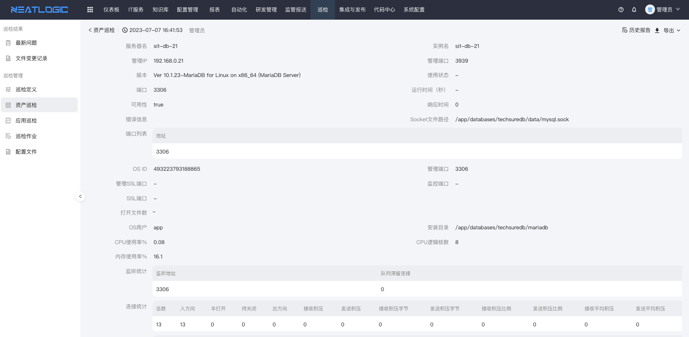

# 数据采集
适用场景：适用于以操作系统层面(包含中间件和数据库)、网络设备层面、存储设备层面、虚拟化平台层面、容器平台层面根据配置的账号、密码、协议、以及[自动发现](../自动发现/网段自动发现.md)和存量的资产对象进行数据全新采集或数据补充。

数据采集具备以下特点：
* 多次执行不会产生多条数据，按资产对象根据唯一表达式进行数据修改和数据追加。
* 对新增对象进行全新采集和关系计算。
* 完善自动发现资产数据详细指标和关系计算。
* 完善IT服务流程管控的配置对象数据完善和关系计算，如应用系统上下线、物理设备上下架等场景。
* 支持自动计算操作系统、中间件、数据库、网络设备、进程调用、网络设备与物理机和存储等关系计算。

## 采集方式说明
采集执行方式，详细参见组合工具文档内的[执行方式](../../自动化/组合工具/组合工具.md#执行方式)。

## 操作系统采集（包含中间件和数据库）
操作系统采集详细参见[操作系统采集](2.操作系统采集.md)说明。

## 网络设备采集
操作系统采集详细参见[网络设备采集](3.网络设备采集.md)说明。

## 虚拟化平台采集
虚拟化平台采集详细参见[虚拟化平台采集](4.虚拟化平台采集.md)说明。

## 容器平台采集
容器云平台采集详细参见[容器云平台采集](5.容器云平台采集.md)说明。

## 存储设备层面
存储设备采集详细参见[存储设备采集](6.存储设备采集.md)说明。

## 对应类型的巡检配置
巡检与采集基本雷同，单巡检对应的组合工具内，多了几个关联插件，如：状态检查（ping、telnet等）、巡检的结果与资产关联插件、生成报告插件。
 
<b>说明：</b>此处以一个示例枚举巡检的组合工具配置示例。

## 巡检配置示例

## 巡检报告示例

更多巡检相关的配置和使用，参见[巡检报告](../../巡检/巡检报告.md)。