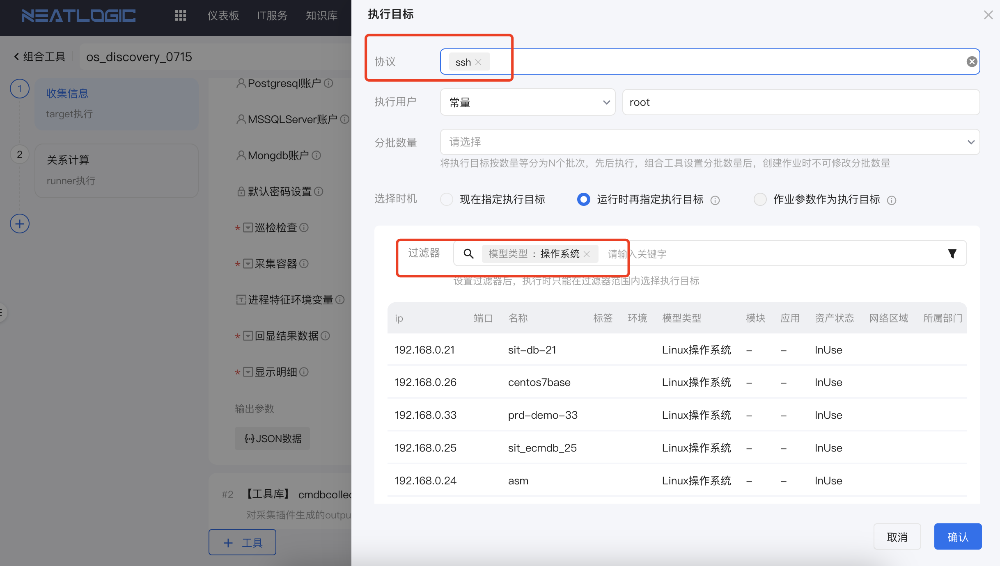

# 操作系统采集
操作系统层面采集：以单个OS为单位一次性发起操作系统数据、中间件数据、数据库数据采集，根据进程匹配对应的采集插件发起数据采集和计算中间件、数据库、操作系统的关系计算。
 
<b>说明：</b>主流的操作系统基本上都支持，国产信创OS支持华为、麒麟、统信、中科方德。

## 支持操作系统列表
<table style="width:100%">
<thead>
    <tr>
        <td>操作系统类型</td>
        <td>架构类型</td>
        <td>概要型号</td>
        <td>支持协议</td>
        <td>推荐协议</td>
        <td>采集概要描述</td>
    </tr>
</thead>
<tbody>
    <tr>
        <td>Linux</td>
        <td>64/32</td>
        <td>Contos、RedHat、Suse、openEuler、Kylin、uniontech等</td>
        <td>ssh/tagent</td>
        <td>tagent</td>
        <td>操作系统基础信息、top进程信息、top内存信息、用户信息、逻辑磁盘、网卡、HBA卡等</td>
    </tr>
    <tr>
        <td>Aix</td>
        <td>64/32</td>
        <td>Aix4+</td>
        <td>ssh/tagent</td>
        <td>tagent</td>
        <td>操作系统基础信息、top进程信息、top内存信息、用户信息、逻辑磁盘、网卡、HBA卡等</td>
    </tr>
    <tr>
        <td>Windows</td>
        <td>64/32</td>
        <td>Windows2000、Windows2003、Windows 2008、Windows 2012等2012+版本</td>
        <td>winrm/tagent</td>
        <td>tagent</td>
        <td>操作系统基础信息、top进程信息、top内存信息、用户信息、逻辑磁盘、网卡等</td>
    </tr>
</tbody>
</table>

## 推荐协议
连接协议推荐使用tagent服务，推荐原因如下：

### Unix类(Aix、Linux)
* 机器账号密码经常变更。
* 机器上多账号，不想在平台上维护不同用户密码。
* 深度使用自动化运维，如：资源安装交付。

### Windows类
* windows不同版本winrm协议不稳定和配置复杂度高。
* 机器账号密码经常变更。
* 机器上多账号，不想在平台上维护不同用户密码。

## Tagent服务
Tagent服务安装、部署、使用详细参考[Tagent服务](../../自动化/Tagent服务/Tagent服务.md)。

# 中间件采集
基于操作系统采集一次连接根据进行插件关键字或特征匹配采集和关系调用计算。

## 支持中间件列表
<table style="width:100%">
<thead>
    <tr>
        <td>中间件类型</td>
        <td>采集方式</td>
        <td>采集概要描述</td>
    </tr>
</thead>
<tbody>
    <tr>
        <td>Java进程</td>
        <td rowspan="3">抓取进程信息</td>
        <td rowspan="3">进程基本信息、安装目录、配置目录、jdk版本、参数等</td>
    </tr>
    <tr>
        <td>Python进程</td>
    </tr>
    <tr>
        <td>PHP进程</td>
    </tr>
    <tr>
        <td>Tomcat</td>
        <td>读取配置文件</td>
        <td>软件基本信息、安装目录、配置目录、jdk版本、参数、服务实例等</td>
    </tr>
    <tr>
        <td>ActiveMQ</td>
        <td>读取配置文件</td>
        <td>软件基本信息、安装目录、配置目录等</td>
    </tr>
    <tr>
        <td>Apache</td>
        <td>读取配置文件</td>
        <td>软件基本信息、安装目录、配置目录等</td>
    </tr>
    <tr>
        <td>Jetty</td>
        <td>读取配置文件</td>
        <td>软件基本信息、安装目录、配置目录等</td>
    </tr>
    <tr>
        <td>RabbitMQ</td>
        <td>读取配置文件</td>
        <td>软件基本信息、安装目录、配置目录等</td>
    </tr>
    <tr>
        <td>Weblogic</td>
        <td>读取配置文件</td>
        <td>软件基本信息、安装目录、配置目录、服务器、服务实例等</td>
    </tr>
    <tr>
        <td>Websphere</td>
        <td>读取配置文件</td>
        <td>软件基本信息、安装目录、配置目录、服务器、服务实例等</td>
    </tr>
    <tr>
        <td>Jboss</td>
        <td>读取配置文件</td>
        <td>软件基本信息、安装目录、配置目录等</td>
    </tr>
    <tr>
        <td>Kafka</td>
        <td>读取配置文件</td>
        <td>软件基本信息、安装目录、配置目录等</td>
    </tr>
    <tr>
        <td>IIS</td>
        <td>读取配置文件</td>
        <td>软件基本信息、安装目录、配置目录等</td>
    </tr>
    <tr>
        <td>Hadoop</td>
        <td>读取配置文件</td>
        <td>软件基本信息、安装目录、配置目录等</td>
    </tr>
    <tr>
        <td>Keepalived</td>
        <td>读取配置文件</td>
        <td>软件基本信息、安装目录、配置目录等</td>
    </tr>
    <tr>
        <td>Lighttpd</td>
        <td>读取配置文件</td>
        <td>软件基本信息、安装目录、配置目录等</td>
    </tr>
    <tr>
        <td>Memcached</td>
        <td>读取配置文件</td>
        <td>软件基本信息、安装目录、配置目录等</td>
    </tr>
    <tr>
        <td>Nginx</td>
        <td>读取配置文件</td>
        <td>软件基本信息、安装目录、配置目录、转发规则、调用关系等</td>
    </tr>
    <tr>
        <td>Zookeeper</td>
        <td>读取配置文件</td>
        <td>软件基本信息、安装目录、配置目录等</td>
    </tr>
    <tr>
        <td>Resin</td>
        <td>读取配置文件</td>
        <td>软件基本信息、安装目录、配置目录等</td>
    </tr>
    <tr>
        <td>Tuxedo</td>
        <td>读取配置文件</td>
        <td>软件基本信息、安装目录、配置目录等</td>
    </tr>
    <tr>
        <td>VCS</td>
        <td>读取配置文件</td>
        <td>软件基本信息、安装目录、配置目录、操作系统HA等</td>
    </tr>
</tbody>
</table>

# 数据库采集
基于操作系统采集一次连接根据进行插件关键字或特征匹配采集和关系调用计算，建议每个数据库类型提供公共的只读账号和密码。

## 支持数据库列表
<table style="width:100%">
<thead>
    <tr>
        <td>数据库类型</td>
        <td>采集方式</td>
        <td>采集概要描述</td>
    </tr>
</thead>
<tbody>
    <tr>
        <td>MySQL</td>
        <td >mysql客户端</td>
        <td >进程基本信息、安装目录、配置目录、数据库实例、服务名、参数等</td>
    </tr>
    <tr>
        <td>Oracle</td>
        <td >sqlplus客户端</td>
        <td >进程基本信息、安装目录、配置目录、数据库实例、服务名、参数等</td>
    </tr>
    <tr>
        <td>SQLServer</td>
            <td >MSSQL客户端</td>
        <td >进程基本信息、安装目录、配置目录、数据库实例、服务名、参数等</td>
    </tr>
    <tr>
        <td>Informix</td>
        <td >cli</td>
        <td >进程基本信息、安装目录、配置目录、数据库实例、服务名、参数等</td>
    </tr>
    <tr>
        <td>DB2</td>
        <td >cli</td>
        <td >进程基本信息、安装目录、配置目录、数据库实例、服务名、参数等</td>
    </tr>
    <tr>
        <td>ElasticSearch</td>
        <td >cli</td>
        <td >进程基本信息、安装目录、配置目录、数据库实例、服务名、参数等</td>
    </tr>
    <tr>
        <td>Sybase</td>
        <td >cli</td>
        <td >进程基本信息、安装目录、配置目录、数据库实例、服务名、参数等</td>
    </tr>
    <tr>
        <td>Postgresql</td>
        <td >cli</td>
        <td >进程基本信息、安装目录、配置目录、数据库实例、服务名、参数等</td>
    </tr>
    <tr>
        <td>Redis</td>
        <td >cli</td>
        <td >进程基本信息、安装目录、配置目录、数据库实例、服务名、参数等</td>
    </tr>
    <tr>
        <td>Mongodb</td>
        <td >cli</td>
        <td >进程基本信息、安装目录、配置目录、数据库实例、服务名、参数等</td>
    </tr>
</tbody>
</table>

# 编排工具和插件

## os采集通用组合工具示例
os采集插件和把采集的数据归档到DB

计算os采集数据关系

## os采集插件参数详解

关键指标讲解 
<table style="width:100%">
<thead>
    <tr>
        <td>参数名</td>
        <td>作用范围</td>
        <td>是否必填</td>
        <td>描述</td>
    </tr>
</thead>
<tbody>
    <tr>
        <td>采集类列表</td>
        <td>默认采集OS节点上能匹配条件的插件数据</td>
        <td >否</td>
        <td >默认是采集所有进程匹配的操作系统、中间件、数据库数据，同时也可以指定采集某一类，适用于巡检。</td>
    </tr>
    <tr>
        <td>账号账号</td>
        <td>MySQL、Postgresql、MSSQLServer、Mongdb采集插件采集数据的必要只读账号</td>
        <td >否</td>
        <td >不提供账号也能执行，但是采集的数据指标不完整</td>
    </tr>
    <tr>
        <td>默认密码设置</td>
        <td>不依赖执行节点的账号或公共账号，额外设置的独立密码，适用于具备统一的采集账户。</td>
        <td >否</td>
        <td >配置范例：Mysql:用户/密码,Postgresql:用户/密码，如：Mysql:root/demo1234,Postgresql:demo/test1234</td>
    </tr>
    <tr>
        <td>巡检检查</td>
        <td>适用于巡检场景</td>
        <td >是</td>
        <td >是否需要采集性能指标数据，如top CPU、内存等</td>
    </tr>
    <tr>
        <td>采集容器</td>
        <td>目前只针对docker容器</td>
        <td >是</td>
        <td >如果选择是，将采集操作系统层面的容器进程信息。</td>
    </tr>
    <tr>
        <td>进程特征环境变量</td>
        <td>作用于Python进程、PHP进程、Python进程采集时数据过滤，默认采集所有匹配的进程，如配置环境变量只匹配符合条件的进程信息</td>
        <td >否</td>
        <td >不提供账号也能执行，但是采集的数据指标不完整</td>
    </tr>
</tbody>
</table>

## os采集目标和节点范围
一般情况下批量采集或定时执行采集，建议以配置模型数据、或标签（Aix、Linux、Windows）节点数据作为执行目标。

## 采集数据同步到配置管理
<b>关于配置映射和策略执行:</b> 详细参考[同步数据配置映射](0.同步数据配置映射.md)。

