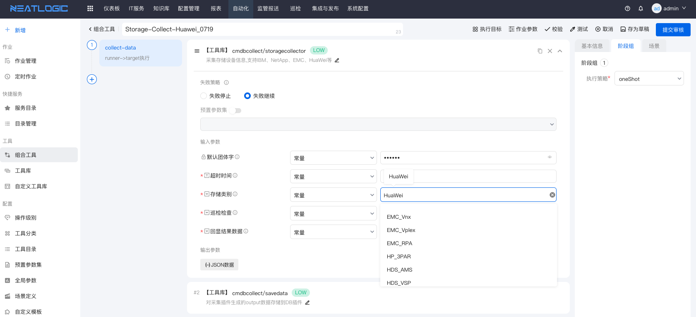

# 存储设备采集
存储设备的采集主要包括光纤交换机、不同厂商的存储设备，存储设备的采集方式比较多，需要结合多种方式进行，SNMP、SMI、SSH、CLI工具等方式进行。
CLI的方式需要配置对应的客户端、采集用户、密码、白名单等策略，相关的配置因设备而异。
 
<b>说明:</b>存储基本上没太多标准，需因具体的实际环境而定。
## 支持虚拟化列表
<table style="width:100%">
<thead>
    <tr>
        <td>类型</td>
        <td>厂商</td>
        <td>协议</td>
        <td>必要条件</td>
        <td>采集概要</td>
    </tr>
</thead>
<tbody>
    <tr>
        <td rowspan="5">光纤交换机</td>
        <td>Dell</td>
        <td>SNMP</td>
        <td>提供只读团体字</td>
        <td>采集基础信息、端口、网卡等</td>
    </tr>
    <tr>
        <td>HP</td>
        <td>SNMP</td>
        <td>提供只读团体字</td>
        <td>采集基础信息、端口、网卡等</td>
    </tr>
    <tr>
        <td>IBM</td>
        <td>SNMP</td>
        <td>提供只读团体字</td>
        <td>采集基础信息、端口、网卡等</td>
    </tr>
    <tr>
        <td>华为</td>
        <td>SNMP</td>
        <td>提供只读团体字</td>
        <td>采集基础信息、端口、网卡等</td>
    </tr>
    <tr>
        <td>浪潮</td>
        <td>SNMP</td>
        <td>提供只读团体字</td>
        <td>采集基础信息、端口、网卡等</td>
    </tr>
    <tr>
        <td rowspan="12">存储设备</td>
        <td>EMC VNX</td>
        <td>SSH</td>
        <td>ssh账号、密码</td>
        <td>采集基础信息、group、cluster等</td>
    </tr>
    <tr>
        <td>EMC RPA</td>
        <td>Navisphere CLI</td>
        <td>ssh账号、密码</td>
        <td>采集基础信息、disk、pool、lun等</td>
    </tr>
    <tr>
        <td>NetApp</td>
        <td>SSH/SNMP</td>
        <td>团体字/ssh账号、密码</td>
        <td>采集基础信息、disk、pool、lun等</td>
    </tr>
    <tr>
        <td>IBM DS系列</td>
        <td>dscli CLI</td>
        <td>ssh账号、密码</td>
        <td>采集基础信息、disk、pool、lun等</td>
    </tr>
    <tr>
        <td>IBM Flash系列</td>
        <td>SSH</td>
        <td>ssh账号、密码</td>
        <td>采集基础信息、disk、pool、lun等</td>
    </tr>
    <tr>
        <td>IBM V7000系列</td>
        <td>SSH</td>
        <td>ssh账号、密码</td>
        <td>采集基础信息、disk、pool、lun等</td>
    </tr>
    <tr>
        <td>IBM SVC</td>
        <td>SSH</td>
        <td>ssh账号、密码</td>
        <td>采集基础信息、disk、pool、lun等</td>
    </tr>
    <tr>
        <td>IBM FlashSystem 900</td>
        <td>SSH</td>
        <td>ssh账号、密码</td>
        <td>采集基础信息、disk、pool、lun等</td>
    </tr>
    <tr>
        <td>HDS VSP系列</td>
        <td>hds cli</td>
        <td>ssh账号、密码</td>
        <td>采集基础信息、disk、pool、lun等</td>
    </tr>
    <tr>
        <td>HDS AMS系列</td>
        <td>stonavm cli</td>
        <td>ssh账号、密码</td>
        <td>采集基础信息、disk、pool、lun等</td>
    </tr>
    <tr>
        <td>华为系列</td>
        <td>SNMP/SMI</td>
        <td>团体字</td>
        <td>采集基础信息、disk、pool、lun等</td>
    </tr>
    <tr>
        <td>HP 3PAR</td>
        <td>SNMP/SMI</td>
        <td>团体字</td>
        <td>采集基础信息、disk、pool、lun等</td>
    </tr>
</tbody>
</table>

# 编排工具和插件
不同的存储设备配置不一，存储采集插件主要采集数据和关系计算。
 
<b>说明：</b>此处只枚举一个案例，更多同类插件和使用参见[工具库](../../自动化/工具库/工具库.md)的插件帮助和说明。

## 采集组合工具示例
采集插件和把采集的数据归档到DB

## 采集目标和节点范围
存储采集以配置模型内的存储资产数据为执行节点，插件执行时自动获取节点的IP、端口、以及用户和密码。

## 采集数据同步到配置管理
<b>关于配置映射和策略执行:</b> 详细参考[同步数据配置映射](0.同步数据配置映射.md)。

